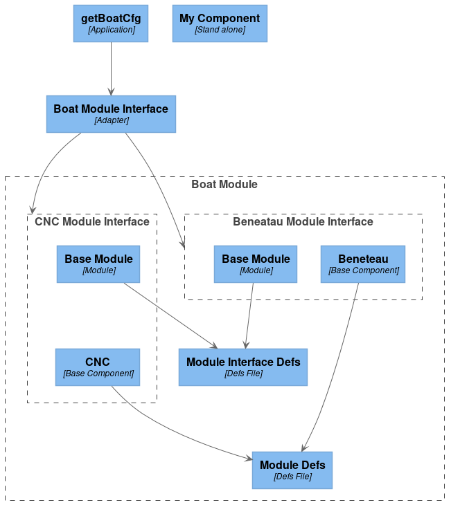

# Table of Contents

1.  [The Generated module interface](#orgfa5ddd2)
    1.  [Summary](#orgad6d7b2)
    2.  [Example](#orgf42f68f)
    3.  [Architecture](#org044000e)
    4.  [Background](#org580aa74)
        1.  [Opaque Pointers](#org03487da)
        2.  [Weak Symbols](#org50d2ad6)
        3.  [Object file merging and symbol renaming](#orgd2326f2)

# The Generated module interface

## Summary

This repo aims to explore ways of creating an interface which can have components swapped out and a flexible configuration.

## Example

Compiling the source cleanly.

    make -B

<table border="2" cellspacing="0" cellpadding="6" rules="groups" frame="hsides">

<colgroup>
<col  class="org-left" />

<col  class="org-left" />

<col  class="org-left" />

<col  class="org-left" />

<col  class="org-left" />

<col  class="org-left" />

<col  class="org-left" />
</colgroup>
<tbody>
<tr>
<td class="org-left">gcc</td>
<td class="org-left">-c</td>
<td class="org-left">-fPIE</td>
<td class="org-left">beneteau.c</td>
<td class="org-left">&#xa0;</td>
<td class="org-left">&#xa0;</td>
<td class="org-left">&#xa0;</td>
</tr>

<tr>
<td class="org-left">gcc</td>
<td class="org-left">-c</td>
<td class="org-left">-fPIE</td>
<td class="org-left">cnc.c</td>
<td class="org-left">&#xa0;</td>
<td class="org-left">&#xa0;</td>
<td class="org-left">&#xa0;</td>
</tr>

<tr>
<td class="org-left">gcc</td>
<td class="org-left">-c</td>
<td class="org-left">-fPIE</td>
<td class="org-left">boatModule.c</td>
<td class="org-left">&#xa0;</td>
<td class="org-left">&#xa0;</td>
<td class="org-left">&#xa0;</td>
</tr>

<tr>
<td class="org-left">ld</td>
<td class="org-left">-r</td>
<td class="org-left">cnc.o</td>
<td class="org-left">boatModule.o</td>
<td class="org-left">-o</td>
<td class="org-left">boatModule_Cnc.o</td>
<td class="org-left">&#xa0;</td>
</tr>

<tr>
<td class="org-left">objcopy</td>
<td class="org-left">&#x2013;redefine-sym</td>
<td class="org-left">printCfg=printCfg_CNC</td>
<td class="org-left">boatModule_Cnc.o</td>
<td class="org-left">&#xa0;</td>
<td class="org-left">&#xa0;</td>
<td class="org-left">&#xa0;</td>
</tr>

<tr>
<td class="org-left">objcopy</td>
<td class="org-left">&#x2013;redefine-sym</td>
<td class="org-left">init_moduleIF=init_moduleIF_CNC</td>
<td class="org-left">boatModule_Cnc.o</td>
<td class="org-left">&#xa0;</td>
<td class="org-left">&#xa0;</td>
<td class="org-left">&#xa0;</td>
</tr>

<tr>
<td class="org-left">objcopy</td>
<td class="org-left">&#x2013;redefine-sym</td>
<td class="org-left">dfltBoatCfg=dfltBoatCfg_CNC</td>
<td class="org-left">boatModule_Cnc.o</td>
<td class="org-left">&#xa0;</td>
<td class="org-left">&#xa0;</td>
<td class="org-left">&#xa0;</td>
</tr>

<tr>
<td class="org-left">ld</td>
<td class="org-left">-r</td>
<td class="org-left">beneteau.o</td>
<td class="org-left">boatModule.o</td>
<td class="org-left">-o</td>
<td class="org-left">boatModule_Beneteau.o</td>
<td class="org-left">&#xa0;</td>
</tr>

<tr>
<td class="org-left">objcopy</td>
<td class="org-left">&#x2013;redefine-sym</td>
<td class="org-left">printCfg=printCfg_Beneteau</td>
<td class="org-left">boatModule_Beneteau.o</td>
<td class="org-left">&#xa0;</td>
<td class="org-left">&#xa0;</td>
<td class="org-left">&#xa0;</td>
</tr>

<tr>
<td class="org-left">objcopy</td>
<td class="org-left">&#x2013;redefine-sym</td>
<td class="org-left">init_moduleIF=init_moduleIF_Beneteau</td>
<td class="org-left">boatModule_Beneteau.o</td>
<td class="org-left">&#xa0;</td>
<td class="org-left">&#xa0;</td>
<td class="org-left">&#xa0;</td>
</tr>

<tr>
<td class="org-left">objcopy</td>
<td class="org-left">&#x2013;redefine-sym</td>
<td class="org-left">dfltBoatCfg=dfltBoatCfg_Beneteau</td>
<td class="org-left">boatModule_Beneteau.o</td>
<td class="org-left">&#xa0;</td>
<td class="org-left">&#xa0;</td>
<td class="org-left">&#xa0;</td>
</tr>

<tr>
<td class="org-left">gcc</td>
<td class="org-left">-c</td>
<td class="org-left">boatModuleIF.c</td>
<td class="org-left">&#xa0;</td>
<td class="org-left">&#xa0;</td>
<td class="org-left">&#xa0;</td>
<td class="org-left">&#xa0;</td>
</tr>

<tr>
<td class="org-left">gcc</td>
<td class="org-left">boatModuleIF.o</td>
<td class="org-left">boatModule_Cnc.o</td>
<td class="org-left">boatModule_Beneteau.o</td>
<td class="org-left">main.c</td>
<td class="org-left">-o</td>
<td class="org-left">getBoatCfg</td>
</tr>
</tbody>
</table>

And running the executable

    ./getBoatCfg 0

    speed 10 size 10

The executable can be run with the arguments 0 or 1 to get one of two configurations.

## Architecture

## Background

This is achieved by utlizing a couple neat C tricks:

### Opaque Pointers

Opaque pointers are used to share pointers of some typedef which we want to remain private in one scope but passed as an argument in another (e.g. context pointers)

This is done using the following

In boatModuleIFDefs.h

    //Incomplete definition context in the header
    typedef struct moduleIF_CTX *moduleIF_CTX_t;

In boatModule.c

    //Full Definition in the source
    
    struct moduleIF_CTX {
        uint8_t size;
        uint8_t speed;
    };
    
    //Note callocing for this type is slightly different
    struct moduleIF_CTX * const CTX = calloc(1, sizeof(struct moduleIF_CTX));

### Weak Symbols

Weak symbols are used where we have some symbol which may or may not be defined. This is useful when we want to use a variable as a proxy for determining if some source file is included in our build (at runtime). Or when we have some sort of generic context that contains members that may be applicable in some instances and not in others.

Example Given:

In boatModuleDefs.h

    //Some config that may or may not be needed in creating an instance of a generic interface
    //We declare the symbol but do not define it. The weak attribute allows this to compile regardless of if its defined
    __attribute__((weak)) extern boatCfg_t dfltBoatCfg;

In cnc.c

    #include "boatModuleDefs.h"
    
    //We would define it in some file
    boatCfg_t dfltBoatCfg = {
        .size = 10,
        .speed= 10,
    };

In boatModule.c

    //If we did not compile/link with cnc.c then this global would not be defined and
    //would have no memory address allocated for it.
    if (&dfltBoatCfg) {
        CTX->size = dfltBoatCfg.size;
        CTX->speed = dfltBoatCfg.speed;
    }

### Object file merging and symbol renaming

One of the core tennants of software engineering is developing code that can be reused and swapping out base components. While we can easily swap out our core component (which defines our dfltBoatCfg) we would run into issues if we wanted to compile multiple base components into our project in the form of symbol collisions. To avoid this we employ a couple techniques.

1.  Object file Merging

    First we&rsquo;ll use the gnu utility, ld to merge each of our base components with our module like so:
    
        ld -r cnc.o boatModule.o -o boatModule_Cnc.o
    
        ld -r beneteau.o boatModule.o -o boatModule_Beneteau.o
    
    While we&rsquo;ve created two new object files these will still encounter symbol collisions for any symbols with global scope
    
    As we can see with the following objdumps:
    
        objdump -D beneteau.o
    
    <table border="2" cellspacing="0" cellpadding="6" rules="groups" frame="hsides">
    
    
    <colgroup>
    <col  class="org-left" />
    
    <col  class="org-right" />
    
    <col  class="org-left" />
    
    <col  class="org-left" />
    
    <col  class="org-left" />
    
    <col  class="org-left" />
    
    <col  class="org-left" />
    </colgroup>
    <tbody>
    <tr>
    <td class="org-left">&#xa0;</td>
    <td class="org-right">&#xa0;</td>
    <td class="org-left">&#xa0;</td>
    <td class="org-left">&#xa0;</td>
    <td class="org-left">&#xa0;</td>
    <td class="org-left">&#xa0;</td>
    <td class="org-left">&#xa0;</td>
    </tr>
    
    
    <tr>
    <td class="org-left">beneteau.o:</td>
    <td class="org-right">file</td>
    <td class="org-left">format</td>
    <td class="org-left">elf64-x86-64</td>
    <td class="org-left">&#xa0;</td>
    <td class="org-left">&#xa0;</td>
    <td class="org-left">&#xa0;</td>
    </tr>
    
    
    <tr>
    <td class="org-left">&#xa0;</td>
    <td class="org-right">&#xa0;</td>
    <td class="org-left">&#xa0;</td>
    <td class="org-left">&#xa0;</td>
    <td class="org-left">&#xa0;</td>
    <td class="org-left">&#xa0;</td>
    <td class="org-left">&#xa0;</td>
    </tr>
    
    
    <tr>
    <td class="org-left">&#xa0;</td>
    <td class="org-right">&#xa0;</td>
    <td class="org-left">&#xa0;</td>
    <td class="org-left">&#xa0;</td>
    <td class="org-left">&#xa0;</td>
    <td class="org-left">&#xa0;</td>
    <td class="org-left">&#xa0;</td>
    </tr>
    
    
    <tr>
    <td class="org-left">Disassembly</td>
    <td class="org-right">of</td>
    <td class="org-left">section</td>
    <td class="org-left">.data:</td>
    <td class="org-left">&#xa0;</td>
    <td class="org-left">&#xa0;</td>
    <td class="org-left">&#xa0;</td>
    </tr>
    
    
    <tr>
    <td class="org-left">&#xa0;</td>
    <td class="org-right">&#xa0;</td>
    <td class="org-left">&#xa0;</td>
    <td class="org-left">&#xa0;</td>
    <td class="org-left">&#xa0;</td>
    <td class="org-left">&#xa0;</td>
    <td class="org-left">&#xa0;</td>
    </tr>
    
    
    <tr>
    <td class="org-left">0</td>
    <td class="org-right">&lt;dfltBoatCfg&gt;:</td>
    <td class="org-left">&#xa0;</td>
    <td class="org-left">&#xa0;</td>
    <td class="org-left">&#xa0;</td>
    <td class="org-left">&#xa0;</td>
    <td class="org-left">&#xa0;</td>
    </tr>
    
    
    <tr>
    <td class="org-left">0:</td>
    <td class="org-right">5</td>
    <td class="org-left">.byte</td>
    <td class="org-left">0x5</td>
    <td class="org-left">&#xa0;</td>
    <td class="org-left">&#xa0;</td>
    <td class="org-left">&#xa0;</td>
    </tr>
    
    
    <tr>
    <td class="org-left">1:</td>
    <td class="org-right">5</td>
    <td class="org-left">.byte</td>
    <td class="org-left">0x5</td>
    <td class="org-left">&#xa0;</td>
    <td class="org-left">&#xa0;</td>
    <td class="org-left">&#xa0;</td>
    </tr>
    
    
    <tr>
    <td class="org-left">&#xa0;</td>
    <td class="org-right">&#xa0;</td>
    <td class="org-left">&#xa0;</td>
    <td class="org-left">&#xa0;</td>
    <td class="org-left">&#xa0;</td>
    <td class="org-left">&#xa0;</td>
    <td class="org-left">&#xa0;</td>
    </tr>
    
    
    <tr>
    <td class="org-left">Disassembly</td>
    <td class="org-right">of</td>
    <td class="org-left">section</td>
    <td class="org-left">.comment:</td>
    <td class="org-left">&#xa0;</td>
    <td class="org-left">&#xa0;</td>
    <td class="org-left">&#xa0;</td>
    </tr>
    
    
    <tr>
    <td class="org-left">&#xa0;</td>
    <td class="org-right">&#xa0;</td>
    <td class="org-left">&#xa0;</td>
    <td class="org-left">&#xa0;</td>
    <td class="org-left">&#xa0;</td>
    <td class="org-left">&#xa0;</td>
    <td class="org-left">&#xa0;</td>
    </tr>
    
    
    <tr>
    <td class="org-left">0</td>
    <td class="org-right">&lt;.comment&gt;:</td>
    <td class="org-left">&#xa0;</td>
    <td class="org-left">&#xa0;</td>
    <td class="org-left">&#xa0;</td>
    <td class="org-left">&#xa0;</td>
    <td class="org-left">&#xa0;</td>
    </tr>
    
    
    <tr>
    <td class="org-left">0:</td>
    <td class="org-right">0</td>
    <td class="org-left">47</td>
    <td class="org-left">43</td>
    <td class="org-left">add</td>
    <td class="org-left">%al,0x43(%rdi)</td>
    <td class="org-left">&#xa0;</td>
    </tr>
    
    
    <tr>
    <td class="org-left">3:</td>
    <td class="org-right">43</td>
    <td class="org-left">3a</td>
    <td class="org-left">20</td>
    <td class="org-left">rex.XB</td>
    <td class="org-left">cmp</td>
    <td class="org-left">(%r8),%spl</td>
    </tr>
    
    
    <tr>
    <td class="org-left">6:</td>
    <td class="org-right">28</td>
    <td class="org-left">47</td>
    <td class="org-left">4e</td>
    <td class="org-left">sub</td>
    <td class="org-left">%al,0x4e(%rdi)</td>
    <td class="org-left">&#xa0;</td>
    </tr>
    
    
    <tr>
    <td class="org-left">9:</td>
    <td class="org-right">55</td>
    <td class="org-left">push</td>
    <td class="org-left">%rbp</td>
    <td class="org-left">&#xa0;</td>
    <td class="org-left">&#xa0;</td>
    <td class="org-left">&#xa0;</td>
    </tr>
    
    
    <tr>
    <td class="org-left">a:</td>
    <td class="org-right">29</td>
    <td class="org-left">20</td>
    <td class="org-left">sub</td>
    <td class="org-left">%esp,(%rax)</td>
    <td class="org-left">&#xa0;</td>
    <td class="org-left">&#xa0;</td>
    </tr>
    
    
    <tr>
    <td class="org-left">c:</td>
    <td class="org-right">31</td>
    <td class="org-left">30</td>
    <td class="org-left">xor</td>
    <td class="org-left">%esi,(%rax)</td>
    <td class="org-left">&#xa0;</td>
    <td class="org-left">&#xa0;</td>
    </tr>
    
    
    <tr>
    <td class="org-left">e:</td>
    <td class="org-right">2e</td>
    <td class="org-left">32</td>
    <td class="org-left">2e</td>
    <td class="org-left">xor</td>
    <td class="org-left">%cs:(%rsi),%ch</td>
    <td class="org-left">&#xa0;</td>
    </tr>
    
    
    <tr>
    <td class="org-left">11:</td>
    <td class="org-right">30</td>
    <td class="org-left">0</td>
    <td class="org-left">xor</td>
    <td class="org-left">%al,(%rax)</td>
    <td class="org-left">&#xa0;</td>
    <td class="org-left">&#xa0;</td>
    </tr>
    </tbody>
    </table>
    
        objdump -D boatModule.o
    
    <table border="2" cellspacing="0" cellpadding="6" rules="groups" frame="hsides">
    
    
    <colgroup>
    <col  class="org-right" />
    
    <col  class="org-right" />
    
    <col  class="org-right" />
    
    <col  class="org-left" />
    
    <col  class="org-left" />
    
    <col  class="org-left" />
    
    <col  class="org-left" />
    
    <col  class="org-left" />
    
    <col  class="org-left" />
    
    <col  class="org-left" />
    
    <col  class="org-left" />
    
    <col  class="org-left" />
    
    <col  class="org-left" />
    
    <col  class="org-left" />
    
    <col  class="org-left" />
    </colgroup>
    <tbody>
    <tr>
    <td class="org-right">&#xa0;</td>
    <td class="org-right">&#xa0;</td>
    <td class="org-right">&#xa0;</td>
    <td class="org-left">&#xa0;</td>
    <td class="org-left">&#xa0;</td>
    <td class="org-left">&#xa0;</td>
    <td class="org-left">&#xa0;</td>
    <td class="org-left">&#xa0;</td>
    <td class="org-left">&#xa0;</td>
    <td class="org-left">&#xa0;</td>
    <td class="org-left">&#xa0;</td>
    <td class="org-left">&#xa0;</td>
    <td class="org-left">&#xa0;</td>
    <td class="org-left">&#xa0;</td>
    <td class="org-left">&#xa0;</td>
    </tr>
    
    
    <tr>
    <td class="org-right">boatModule.o:</td>
    <td class="org-right">file</td>
    <td class="org-right">format</td>
    <td class="org-left">elf64-x86-64</td>
    <td class="org-left">&#xa0;</td>
    <td class="org-left">&#xa0;</td>
    <td class="org-left">&#xa0;</td>
    <td class="org-left">&#xa0;</td>
    <td class="org-left">&#xa0;</td>
    <td class="org-left">&#xa0;</td>
    <td class="org-left">&#xa0;</td>
    <td class="org-left">&#xa0;</td>
    <td class="org-left">&#xa0;</td>
    <td class="org-left">&#xa0;</td>
    <td class="org-left">&#xa0;</td>
    </tr>
    
    
    <tr>
    <td class="org-right">&#xa0;</td>
    <td class="org-right">&#xa0;</td>
    <td class="org-right">&#xa0;</td>
    <td class="org-left">&#xa0;</td>
    <td class="org-left">&#xa0;</td>
    <td class="org-left">&#xa0;</td>
    <td class="org-left">&#xa0;</td>
    <td class="org-left">&#xa0;</td>
    <td class="org-left">&#xa0;</td>
    <td class="org-left">&#xa0;</td>
    <td class="org-left">&#xa0;</td>
    <td class="org-left">&#xa0;</td>
    <td class="org-left">&#xa0;</td>
    <td class="org-left">&#xa0;</td>
    <td class="org-left">&#xa0;</td>
    </tr>
    
    
    <tr>
    <td class="org-right">&#xa0;</td>
    <td class="org-right">&#xa0;</td>
    <td class="org-right">&#xa0;</td>
    <td class="org-left">&#xa0;</td>
    <td class="org-left">&#xa0;</td>
    <td class="org-left">&#xa0;</td>
    <td class="org-left">&#xa0;</td>
    <td class="org-left">&#xa0;</td>
    <td class="org-left">&#xa0;</td>
    <td class="org-left">&#xa0;</td>
    <td class="org-left">&#xa0;</td>
    <td class="org-left">&#xa0;</td>
    <td class="org-left">&#xa0;</td>
    <td class="org-left">&#xa0;</td>
    <td class="org-left">&#xa0;</td>
    </tr>
    
    
    <tr>
    <td class="org-right">Disassembly</td>
    <td class="org-right">of</td>
    <td class="org-right">section</td>
    <td class="org-left">.text:</td>
    <td class="org-left">&#xa0;</td>
    <td class="org-left">&#xa0;</td>
    <td class="org-left">&#xa0;</td>
    <td class="org-left">&#xa0;</td>
    <td class="org-left">&#xa0;</td>
    <td class="org-left">&#xa0;</td>
    <td class="org-left">&#xa0;</td>
    <td class="org-left">&#xa0;</td>
    <td class="org-left">&#xa0;</td>
    <td class="org-left">&#xa0;</td>
    <td class="org-left">&#xa0;</td>
    </tr>
    
    
    <tr>
    <td class="org-right">&#xa0;</td>
    <td class="org-right">&#xa0;</td>
    <td class="org-right">&#xa0;</td>
    <td class="org-left">&#xa0;</td>
    <td class="org-left">&#xa0;</td>
    <td class="org-left">&#xa0;</td>
    <td class="org-left">&#xa0;</td>
    <td class="org-left">&#xa0;</td>
    <td class="org-left">&#xa0;</td>
    <td class="org-left">&#xa0;</td>
    <td class="org-left">&#xa0;</td>
    <td class="org-left">&#xa0;</td>
    <td class="org-left">&#xa0;</td>
    <td class="org-left">&#xa0;</td>
    <td class="org-left">&#xa0;</td>
    </tr>
    
    
    <tr>
    <td class="org-right">0</td>
    <td class="org-right">&lt;printCfg&gt;:</td>
    <td class="org-right">&#xa0;</td>
    <td class="org-left">&#xa0;</td>
    <td class="org-left">&#xa0;</td>
    <td class="org-left">&#xa0;</td>
    <td class="org-left">&#xa0;</td>
    <td class="org-left">&#xa0;</td>
    <td class="org-left">&#xa0;</td>
    <td class="org-left">&#xa0;</td>
    <td class="org-left">&#xa0;</td>
    <td class="org-left">&#xa0;</td>
    <td class="org-left">&#xa0;</td>
    <td class="org-left">&#xa0;</td>
    <td class="org-left">&#xa0;</td>
    </tr>
    
    
    <tr>
    <td class="org-right">0:</td>
    <td class="org-right">55</td>
    <td class="org-right">push</td>
    <td class="org-left">%rbp</td>
    <td class="org-left">&#xa0;</td>
    <td class="org-left">&#xa0;</td>
    <td class="org-left">&#xa0;</td>
    <td class="org-left">&#xa0;</td>
    <td class="org-left">&#xa0;</td>
    <td class="org-left">&#xa0;</td>
    <td class="org-left">&#xa0;</td>
    <td class="org-left">&#xa0;</td>
    <td class="org-left">&#xa0;</td>
    <td class="org-left">&#xa0;</td>
    <td class="org-left">&#xa0;</td>
    </tr>
    
    
    <tr>
    <td class="org-right">1:</td>
    <td class="org-right">48</td>
    <td class="org-right">89</td>
    <td class="org-left">e5</td>
    <td class="org-left">mov</td>
    <td class="org-left">%rsp,%rbp</td>
    <td class="org-left">&#xa0;</td>
    <td class="org-left">&#xa0;</td>
    <td class="org-left">&#xa0;</td>
    <td class="org-left">&#xa0;</td>
    <td class="org-left">&#xa0;</td>
    <td class="org-left">&#xa0;</td>
    <td class="org-left">&#xa0;</td>
    <td class="org-left">&#xa0;</td>
    <td class="org-left">&#xa0;</td>
    </tr>
    
    
    <tr>
    <td class="org-right">4:</td>
    <td class="org-right">48</td>
    <td class="org-right">83</td>
    <td class="org-left">ec</td>
    <td class="org-left">10</td>
    <td class="org-left">sub</td>
    <td class="org-left">$0x10,%rsp</td>
    <td class="org-left">&#xa0;</td>
    <td class="org-left">&#xa0;</td>
    <td class="org-left">&#xa0;</td>
    <td class="org-left">&#xa0;</td>
    <td class="org-left">&#xa0;</td>
    <td class="org-left">&#xa0;</td>
    <td class="org-left">&#xa0;</td>
    <td class="org-left">&#xa0;</td>
    </tr>
    
    
    <tr>
    <td class="org-right">8:</td>
    <td class="org-right">48</td>
    <td class="org-right">89</td>
    <td class="org-left">7d</td>
    <td class="org-left">f8</td>
    <td class="org-left">mov</td>
    <td class="org-left">%rdi,-0x8(%rbp)</td>
    <td class="org-left">&#xa0;</td>
    <td class="org-left">&#xa0;</td>
    <td class="org-left">&#xa0;</td>
    <td class="org-left">&#xa0;</td>
    <td class="org-left">&#xa0;</td>
    <td class="org-left">&#xa0;</td>
    <td class="org-left">&#xa0;</td>
    <td class="org-left">&#xa0;</td>
    </tr>
    
    
    <tr>
    <td class="org-right">c:</td>
    <td class="org-right">48</td>
    <td class="org-right">8b</td>
    <td class="org-left">45</td>
    <td class="org-left">f8</td>
    <td class="org-left">mov</td>
    <td class="org-left">-0x8(%rbp),%rax</td>
    <td class="org-left">&#xa0;</td>
    <td class="org-left">&#xa0;</td>
    <td class="org-left">&#xa0;</td>
    <td class="org-left">&#xa0;</td>
    <td class="org-left">&#xa0;</td>
    <td class="org-left">&#xa0;</td>
    <td class="org-left">&#xa0;</td>
    <td class="org-left">&#xa0;</td>
    </tr>
    
    
    <tr>
    <td class="org-right">10:</td>
    <td class="org-right">0f</td>
    <td class="org-right">b6</td>
    <td class="org-left">0</td>
    <td class="org-left">movzbl</td>
    <td class="org-left">(%rax),%eax</td>
    <td class="org-left">&#xa0;</td>
    <td class="org-left">&#xa0;</td>
    <td class="org-left">&#xa0;</td>
    <td class="org-left">&#xa0;</td>
    <td class="org-left">&#xa0;</td>
    <td class="org-left">&#xa0;</td>
    <td class="org-left">&#xa0;</td>
    <td class="org-left">&#xa0;</td>
    <td class="org-left">&#xa0;</td>
    </tr>
    
    
    <tr>
    <td class="org-right">13:</td>
    <td class="org-right">0f</td>
    <td class="org-right">b6</td>
    <td class="org-left">d0</td>
    <td class="org-left">movzbl</td>
    <td class="org-left">%al,%edx</td>
    <td class="org-left">&#xa0;</td>
    <td class="org-left">&#xa0;</td>
    <td class="org-left">&#xa0;</td>
    <td class="org-left">&#xa0;</td>
    <td class="org-left">&#xa0;</td>
    <td class="org-left">&#xa0;</td>
    <td class="org-left">&#xa0;</td>
    <td class="org-left">&#xa0;</td>
    <td class="org-left">&#xa0;</td>
    </tr>
    
    
    <tr>
    <td class="org-right">16:</td>
    <td class="org-right">48</td>
    <td class="org-right">8b</td>
    <td class="org-left">45</td>
    <td class="org-left">f8</td>
    <td class="org-left">mov</td>
    <td class="org-left">-0x8(%rbp),%rax</td>
    <td class="org-left">&#xa0;</td>
    <td class="org-left">&#xa0;</td>
    <td class="org-left">&#xa0;</td>
    <td class="org-left">&#xa0;</td>
    <td class="org-left">&#xa0;</td>
    <td class="org-left">&#xa0;</td>
    <td class="org-left">&#xa0;</td>
    <td class="org-left">&#xa0;</td>
    </tr>
    
    
    <tr>
    <td class="org-right">1a:</td>
    <td class="org-right">0f</td>
    <td class="org-right">b6</td>
    <td class="org-left">40</td>
    <td class="org-left">1</td>
    <td class="org-left">movzbl</td>
    <td class="org-left">0x1(%rax),%eax</td>
    <td class="org-left">&#xa0;</td>
    <td class="org-left">&#xa0;</td>
    <td class="org-left">&#xa0;</td>
    <td class="org-left">&#xa0;</td>
    <td class="org-left">&#xa0;</td>
    <td class="org-left">&#xa0;</td>
    <td class="org-left">&#xa0;</td>
    <td class="org-left">&#xa0;</td>
    </tr>
    
    
    <tr>
    <td class="org-right">1e:</td>
    <td class="org-right">0f</td>
    <td class="org-right">b6</td>
    <td class="org-left">c0</td>
    <td class="org-left">movzbl</td>
    <td class="org-left">%al,%eax</td>
    <td class="org-left">&#xa0;</td>
    <td class="org-left">&#xa0;</td>
    <td class="org-left">&#xa0;</td>
    <td class="org-left">&#xa0;</td>
    <td class="org-left">&#xa0;</td>
    <td class="org-left">&#xa0;</td>
    <td class="org-left">&#xa0;</td>
    <td class="org-left">&#xa0;</td>
    <td class="org-left">&#xa0;</td>
    </tr>
    
    
    <tr>
    <td class="org-right">21:</td>
    <td class="org-right">89</td>
    <td class="org-right">c6</td>
    <td class="org-left">mov</td>
    <td class="org-left">%eax,%esi</td>
    <td class="org-left">&#xa0;</td>
    <td class="org-left">&#xa0;</td>
    <td class="org-left">&#xa0;</td>
    <td class="org-left">&#xa0;</td>
    <td class="org-left">&#xa0;</td>
    <td class="org-left">&#xa0;</td>
    <td class="org-left">&#xa0;</td>
    <td class="org-left">&#xa0;</td>
    <td class="org-left">&#xa0;</td>
    <td class="org-left">&#xa0;</td>
    </tr>
    
    
    <tr>
    <td class="org-right">23:</td>
    <td class="org-right">48</td>
    <td class="org-right">8d</td>
    <td class="org-left">3d</td>
    <td class="org-left">0</td>
    <td class="org-left">0</td>
    <td class="org-left">0</td>
    <td class="org-left">0</td>
    <td class="org-left">lea</td>
    <td class="org-left">0x0(%rip),%rdi</td>
    <td class="org-left">#</td>
    <td class="org-left">2a</td>
    <td class="org-left">&lt;printCfg+0x2a&gt;</td>
    <td class="org-left">&#xa0;</td>
    <td class="org-left">&#xa0;</td>
    </tr>
    
    
    <tr>
    <td class="org-right">2a:</td>
    <td class="org-right">b8</td>
    <td class="org-right">0</td>
    <td class="org-left">0</td>
    <td class="org-left">0</td>
    <td class="org-left">0</td>
    <td class="org-left">mov</td>
    <td class="org-left">$0x0,%eax</td>
    <td class="org-left">&#xa0;</td>
    <td class="org-left">&#xa0;</td>
    <td class="org-left">&#xa0;</td>
    <td class="org-left">&#xa0;</td>
    <td class="org-left">&#xa0;</td>
    <td class="org-left">&#xa0;</td>
    <td class="org-left">&#xa0;</td>
    </tr>
    
    
    <tr>
    <td class="org-right">2f:</td>
    <td class="org-right">e8</td>
    <td class="org-right">0</td>
    <td class="org-left">0</td>
    <td class="org-left">0</td>
    <td class="org-left">0</td>
    <td class="org-left">callq</td>
    <td class="org-left">34</td>
    <td class="org-left">&lt;printCfg+0x34&gt;</td>
    <td class="org-left">&#xa0;</td>
    <td class="org-left">&#xa0;</td>
    <td class="org-left">&#xa0;</td>
    <td class="org-left">&#xa0;</td>
    <td class="org-left">&#xa0;</td>
    <td class="org-left">&#xa0;</td>
    </tr>
    
    
    <tr>
    <td class="org-right">34:</td>
    <td class="org-right">90</td>
    <td class="org-right">nop</td>
    <td class="org-left">&#xa0;</td>
    <td class="org-left">&#xa0;</td>
    <td class="org-left">&#xa0;</td>
    <td class="org-left">&#xa0;</td>
    <td class="org-left">&#xa0;</td>
    <td class="org-left">&#xa0;</td>
    <td class="org-left">&#xa0;</td>
    <td class="org-left">&#xa0;</td>
    <td class="org-left">&#xa0;</td>
    <td class="org-left">&#xa0;</td>
    <td class="org-left">&#xa0;</td>
    <td class="org-left">&#xa0;</td>
    </tr>
    
    
    <tr>
    <td class="org-right">35:</td>
    <td class="org-right">c9</td>
    <td class="org-right">leaveq</td>
    <td class="org-left">&#xa0;</td>
    <td class="org-left">&#xa0;</td>
    <td class="org-left">&#xa0;</td>
    <td class="org-left">&#xa0;</td>
    <td class="org-left">&#xa0;</td>
    <td class="org-left">&#xa0;</td>
    <td class="org-left">&#xa0;</td>
    <td class="org-left">&#xa0;</td>
    <td class="org-left">&#xa0;</td>
    <td class="org-left">&#xa0;</td>
    <td class="org-left">&#xa0;</td>
    <td class="org-left">&#xa0;</td>
    </tr>
    
    
    <tr>
    <td class="org-right">36:</td>
    <td class="org-right">c3</td>
    <td class="org-right">retq</td>
    <td class="org-left">&#xa0;</td>
    <td class="org-left">&#xa0;</td>
    <td class="org-left">&#xa0;</td>
    <td class="org-left">&#xa0;</td>
    <td class="org-left">&#xa0;</td>
    <td class="org-left">&#xa0;</td>
    <td class="org-left">&#xa0;</td>
    <td class="org-left">&#xa0;</td>
    <td class="org-left">&#xa0;</td>
    <td class="org-left">&#xa0;</td>
    <td class="org-left">&#xa0;</td>
    <td class="org-left">&#xa0;</td>
    </tr>
    
    
    <tr>
    <td class="org-right">&#xa0;</td>
    <td class="org-right">&#xa0;</td>
    <td class="org-right">&#xa0;</td>
    <td class="org-left">&#xa0;</td>
    <td class="org-left">&#xa0;</td>
    <td class="org-left">&#xa0;</td>
    <td class="org-left">&#xa0;</td>
    <td class="org-left">&#xa0;</td>
    <td class="org-left">&#xa0;</td>
    <td class="org-left">&#xa0;</td>
    <td class="org-left">&#xa0;</td>
    <td class="org-left">&#xa0;</td>
    <td class="org-left">&#xa0;</td>
    <td class="org-left">&#xa0;</td>
    <td class="org-left">&#xa0;</td>
    </tr>
    
    
    <tr>
    <td class="org-right">37</td>
    <td class="org-right">&lt;init_moduleIF&gt;:</td>
    <td class="org-right">&#xa0;</td>
    <td class="org-left">&#xa0;</td>
    <td class="org-left">&#xa0;</td>
    <td class="org-left">&#xa0;</td>
    <td class="org-left">&#xa0;</td>
    <td class="org-left">&#xa0;</td>
    <td class="org-left">&#xa0;</td>
    <td class="org-left">&#xa0;</td>
    <td class="org-left">&#xa0;</td>
    <td class="org-left">&#xa0;</td>
    <td class="org-left">&#xa0;</td>
    <td class="org-left">&#xa0;</td>
    <td class="org-left">&#xa0;</td>
    </tr>
    
    
    <tr>
    <td class="org-right">37:</td>
    <td class="org-right">55</td>
    <td class="org-right">push</td>
    <td class="org-left">%rbp</td>
    <td class="org-left">&#xa0;</td>
    <td class="org-left">&#xa0;</td>
    <td class="org-left">&#xa0;</td>
    <td class="org-left">&#xa0;</td>
    <td class="org-left">&#xa0;</td>
    <td class="org-left">&#xa0;</td>
    <td class="org-left">&#xa0;</td>
    <td class="org-left">&#xa0;</td>
    <td class="org-left">&#xa0;</td>
    <td class="org-left">&#xa0;</td>
    <td class="org-left">&#xa0;</td>
    </tr>
    
    
    <tr>
    <td class="org-right">38:</td>
    <td class="org-right">48</td>
    <td class="org-right">89</td>
    <td class="org-left">e5</td>
    <td class="org-left">mov</td>
    <td class="org-left">%rsp,%rbp</td>
    <td class="org-left">&#xa0;</td>
    <td class="org-left">&#xa0;</td>
    <td class="org-left">&#xa0;</td>
    <td class="org-left">&#xa0;</td>
    <td class="org-left">&#xa0;</td>
    <td class="org-left">&#xa0;</td>
    <td class="org-left">&#xa0;</td>
    <td class="org-left">&#xa0;</td>
    <td class="org-left">&#xa0;</td>
    </tr>
    
    
    <tr>
    <td class="org-right">3b:</td>
    <td class="org-right">48</td>
    <td class="org-right">83</td>
    <td class="org-left">ec</td>
    <td class="org-left">10</td>
    <td class="org-left">sub</td>
    <td class="org-left">$0x10,%rsp</td>
    <td class="org-left">&#xa0;</td>
    <td class="org-left">&#xa0;</td>
    <td class="org-left">&#xa0;</td>
    <td class="org-left">&#xa0;</td>
    <td class="org-left">&#xa0;</td>
    <td class="org-left">&#xa0;</td>
    <td class="org-left">&#xa0;</td>
    <td class="org-left">&#xa0;</td>
    </tr>
    
    
    <tr>
    <td class="org-right">3f:</td>
    <td class="org-right">be</td>
    <td class="org-right">2</td>
    <td class="org-left">0</td>
    <td class="org-left">0</td>
    <td class="org-left">0</td>
    <td class="org-left">mov</td>
    <td class="org-left">$0x2,%esi</td>
    <td class="org-left">&#xa0;</td>
    <td class="org-left">&#xa0;</td>
    <td class="org-left">&#xa0;</td>
    <td class="org-left">&#xa0;</td>
    <td class="org-left">&#xa0;</td>
    <td class="org-left">&#xa0;</td>
    <td class="org-left">&#xa0;</td>
    </tr>
    
    
    <tr>
    <td class="org-right">44:</td>
    <td class="org-right">bf</td>
    <td class="org-right">1</td>
    <td class="org-left">0</td>
    <td class="org-left">0</td>
    <td class="org-left">0</td>
    <td class="org-left">mov</td>
    <td class="org-left">$0x1,%edi</td>
    <td class="org-left">&#xa0;</td>
    <td class="org-left">&#xa0;</td>
    <td class="org-left">&#xa0;</td>
    <td class="org-left">&#xa0;</td>
    <td class="org-left">&#xa0;</td>
    <td class="org-left">&#xa0;</td>
    <td class="org-left">&#xa0;</td>
    </tr>
    
    
    <tr>
    <td class="org-right">49:</td>
    <td class="org-right">e8</td>
    <td class="org-right">0</td>
    <td class="org-left">0</td>
    <td class="org-left">0</td>
    <td class="org-left">0</td>
    <td class="org-left">callq</td>
    <td class="org-left">4e</td>
    <td class="org-left">&lt;init_moduleIF+0x17&gt;</td>
    <td class="org-left">&#xa0;</td>
    <td class="org-left">&#xa0;</td>
    <td class="org-left">&#xa0;</td>
    <td class="org-left">&#xa0;</td>
    <td class="org-left">&#xa0;</td>
    <td class="org-left">&#xa0;</td>
    </tr>
    
    
    <tr>
    <td class="org-right">4e:</td>
    <td class="org-right">48</td>
    <td class="org-right">89</td>
    <td class="org-left">45</td>
    <td class="org-left">f0</td>
    <td class="org-left">mov</td>
    <td class="org-left">%rax,-0x10(%rbp)</td>
    <td class="org-left">&#xa0;</td>
    <td class="org-left">&#xa0;</td>
    <td class="org-left">&#xa0;</td>
    <td class="org-left">&#xa0;</td>
    <td class="org-left">&#xa0;</td>
    <td class="org-left">&#xa0;</td>
    <td class="org-left">&#xa0;</td>
    <td class="org-left">&#xa0;</td>
    </tr>
    
    
    <tr>
    <td class="org-right">52:</td>
    <td class="org-right">48</td>
    <td class="org-right">8b</td>
    <td class="org-left">5</td>
    <td class="org-left">0</td>
    <td class="org-left">0</td>
    <td class="org-left">0</td>
    <td class="org-left">0</td>
    <td class="org-left">mov</td>
    <td class="org-left">0x0(%rip),%rax</td>
    <td class="org-left">#</td>
    <td class="org-left">59</td>
    <td class="org-left">&lt;init_moduleIF+0x22&gt;</td>
    <td class="org-left">&#xa0;</td>
    <td class="org-left">&#xa0;</td>
    </tr>
    
    
    <tr>
    <td class="org-right">59:</td>
    <td class="org-right">48</td>
    <td class="org-right">85</td>
    <td class="org-left">c0</td>
    <td class="org-left">test</td>
    <td class="org-left">%rax,%rax</td>
    <td class="org-left">&#xa0;</td>
    <td class="org-left">&#xa0;</td>
    <td class="org-left">&#xa0;</td>
    <td class="org-left">&#xa0;</td>
    <td class="org-left">&#xa0;</td>
    <td class="org-left">&#xa0;</td>
    <td class="org-left">&#xa0;</td>
    <td class="org-left">&#xa0;</td>
    <td class="org-left">&#xa0;</td>
    </tr>
    
    
    <tr>
    <td class="org-right">5c:</td>
    <td class="org-right">74</td>
    <td class="org-right">22</td>
    <td class="org-left">je</td>
    <td class="org-left">80</td>
    <td class="org-left">&lt;init_moduleIF+0x49&gt;</td>
    <td class="org-left">&#xa0;</td>
    <td class="org-left">&#xa0;</td>
    <td class="org-left">&#xa0;</td>
    <td class="org-left">&#xa0;</td>
    <td class="org-left">&#xa0;</td>
    <td class="org-left">&#xa0;</td>
    <td class="org-left">&#xa0;</td>
    <td class="org-left">&#xa0;</td>
    <td class="org-left">&#xa0;</td>
    </tr>
    
    
    <tr>
    <td class="org-right">5e:</td>
    <td class="org-right">48</td>
    <td class="org-right">8b</td>
    <td class="org-left">5</td>
    <td class="org-left">0</td>
    <td class="org-left">0</td>
    <td class="org-left">0</td>
    <td class="org-left">0</td>
    <td class="org-left">mov</td>
    <td class="org-left">0x0(%rip),%rax</td>
    <td class="org-left">#</td>
    <td class="org-left">65</td>
    <td class="org-left">&lt;init_moduleIF+0x2e&gt;</td>
    <td class="org-left">&#xa0;</td>
    <td class="org-left">&#xa0;</td>
    </tr>
    
    
    <tr>
    <td class="org-right">65:</td>
    <td class="org-right">0f</td>
    <td class="org-right">b6</td>
    <td class="org-left">10</td>
    <td class="org-left">movzbl</td>
    <td class="org-left">(%rax),%edx</td>
    <td class="org-left">&#xa0;</td>
    <td class="org-left">&#xa0;</td>
    <td class="org-left">&#xa0;</td>
    <td class="org-left">&#xa0;</td>
    <td class="org-left">&#xa0;</td>
    <td class="org-left">&#xa0;</td>
    <td class="org-left">&#xa0;</td>
    <td class="org-left">&#xa0;</td>
    <td class="org-left">&#xa0;</td>
    </tr>
    
    
    <tr>
    <td class="org-right">68:</td>
    <td class="org-right">48</td>
    <td class="org-right">8b</td>
    <td class="org-left">45</td>
    <td class="org-left">f0</td>
    <td class="org-left">mov</td>
    <td class="org-left">-0x10(%rbp),%rax</td>
    <td class="org-left">&#xa0;</td>
    <td class="org-left">&#xa0;</td>
    <td class="org-left">&#xa0;</td>
    <td class="org-left">&#xa0;</td>
    <td class="org-left">&#xa0;</td>
    <td class="org-left">&#xa0;</td>
    <td class="org-left">&#xa0;</td>
    <td class="org-left">&#xa0;</td>
    </tr>
    
    
    <tr>
    <td class="org-right">6c:</td>
    <td class="org-right">88</td>
    <td class="org-right">10</td>
    <td class="org-left">mov</td>
    <td class="org-left">%dl,(%rax)</td>
    <td class="org-left">&#xa0;</td>
    <td class="org-left">&#xa0;</td>
    <td class="org-left">&#xa0;</td>
    <td class="org-left">&#xa0;</td>
    <td class="org-left">&#xa0;</td>
    <td class="org-left">&#xa0;</td>
    <td class="org-left">&#xa0;</td>
    <td class="org-left">&#xa0;</td>
    <td class="org-left">&#xa0;</td>
    <td class="org-left">&#xa0;</td>
    </tr>
    
    
    <tr>
    <td class="org-right">6e:</td>
    <td class="org-right">48</td>
    <td class="org-right">8b</td>
    <td class="org-left">5</td>
    <td class="org-left">0</td>
    <td class="org-left">0</td>
    <td class="org-left">0</td>
    <td class="org-left">0</td>
    <td class="org-left">mov</td>
    <td class="org-left">0x0(%rip),%rax</td>
    <td class="org-left">#</td>
    <td class="org-left">75</td>
    <td class="org-left">&lt;init_moduleIF+0x3e&gt;</td>
    <td class="org-left">&#xa0;</td>
    <td class="org-left">&#xa0;</td>
    </tr>
    
    
    <tr>
    <td class="org-right">75:</td>
    <td class="org-right">0f</td>
    <td class="org-right">b6</td>
    <td class="org-left">50</td>
    <td class="org-left">1</td>
    <td class="org-left">movzbl</td>
    <td class="org-left">0x1(%rax),%edx</td>
    <td class="org-left">&#xa0;</td>
    <td class="org-left">&#xa0;</td>
    <td class="org-left">&#xa0;</td>
    <td class="org-left">&#xa0;</td>
    <td class="org-left">&#xa0;</td>
    <td class="org-left">&#xa0;</td>
    <td class="org-left">&#xa0;</td>
    <td class="org-left">&#xa0;</td>
    </tr>
    
    
    <tr>
    <td class="org-right">79:</td>
    <td class="org-right">48</td>
    <td class="org-right">8b</td>
    <td class="org-left">45</td>
    <td class="org-left">f0</td>
    <td class="org-left">mov</td>
    <td class="org-left">-0x10(%rbp),%rax</td>
    <td class="org-left">&#xa0;</td>
    <td class="org-left">&#xa0;</td>
    <td class="org-left">&#xa0;</td>
    <td class="org-left">&#xa0;</td>
    <td class="org-left">&#xa0;</td>
    <td class="org-left">&#xa0;</td>
    <td class="org-left">&#xa0;</td>
    <td class="org-left">&#xa0;</td>
    </tr>
    
    
    <tr>
    <td class="org-right">7d:</td>
    <td class="org-right">88</td>
    <td class="org-right">50</td>
    <td class="org-left">1</td>
    <td class="org-left">mov</td>
    <td class="org-left">%dl,0x1(%rax)</td>
    <td class="org-left">&#xa0;</td>
    <td class="org-left">&#xa0;</td>
    <td class="org-left">&#xa0;</td>
    <td class="org-left">&#xa0;</td>
    <td class="org-left">&#xa0;</td>
    <td class="org-left">&#xa0;</td>
    <td class="org-left">&#xa0;</td>
    <td class="org-left">&#xa0;</td>
    <td class="org-left">&#xa0;</td>
    </tr>
    
    
    <tr>
    <td class="org-right">80:</td>
    <td class="org-right">be</td>
    <td class="org-right">10</td>
    <td class="org-left">0</td>
    <td class="org-left">0</td>
    <td class="org-left">0</td>
    <td class="org-left">mov</td>
    <td class="org-left">$0x10,%esi</td>
    <td class="org-left">&#xa0;</td>
    <td class="org-left">&#xa0;</td>
    <td class="org-left">&#xa0;</td>
    <td class="org-left">&#xa0;</td>
    <td class="org-left">&#xa0;</td>
    <td class="org-left">&#xa0;</td>
    <td class="org-left">&#xa0;</td>
    </tr>
    
    
    <tr>
    <td class="org-right">85:</td>
    <td class="org-right">bf</td>
    <td class="org-right">1</td>
    <td class="org-left">0</td>
    <td class="org-left">0</td>
    <td class="org-left">0</td>
    <td class="org-left">mov</td>
    <td class="org-left">$0x1,%edi</td>
    <td class="org-left">&#xa0;</td>
    <td class="org-left">&#xa0;</td>
    <td class="org-left">&#xa0;</td>
    <td class="org-left">&#xa0;</td>
    <td class="org-left">&#xa0;</td>
    <td class="org-left">&#xa0;</td>
    <td class="org-left">&#xa0;</td>
    </tr>
    
    
    <tr>
    <td class="org-right">8a:</td>
    <td class="org-right">e8</td>
    <td class="org-right">0</td>
    <td class="org-left">0</td>
    <td class="org-left">0</td>
    <td class="org-left">0</td>
    <td class="org-left">callq</td>
    <td class="org-left">8f</td>
    <td class="org-left">&lt;init_moduleIF+0x58&gt;</td>
    <td class="org-left">&#xa0;</td>
    <td class="org-left">&#xa0;</td>
    <td class="org-left">&#xa0;</td>
    <td class="org-left">&#xa0;</td>
    <td class="org-left">&#xa0;</td>
    <td class="org-left">&#xa0;</td>
    </tr>
    
    
    <tr>
    <td class="org-right">8f:</td>
    <td class="org-right">48</td>
    <td class="org-right">89</td>
    <td class="org-left">45</td>
    <td class="org-left">f8</td>
    <td class="org-left">mov</td>
    <td class="org-left">%rax,-0x8(%rbp)</td>
    <td class="org-left">&#xa0;</td>
    <td class="org-left">&#xa0;</td>
    <td class="org-left">&#xa0;</td>
    <td class="org-left">&#xa0;</td>
    <td class="org-left">&#xa0;</td>
    <td class="org-left">&#xa0;</td>
    <td class="org-left">&#xa0;</td>
    <td class="org-left">&#xa0;</td>
    </tr>
    
    
    <tr>
    <td class="org-right">93:</td>
    <td class="org-right">48</td>
    <td class="org-right">8b</td>
    <td class="org-left">45</td>
    <td class="org-left">f8</td>
    <td class="org-left">mov</td>
    <td class="org-left">-0x8(%rbp),%rax</td>
    <td class="org-left">&#xa0;</td>
    <td class="org-left">&#xa0;</td>
    <td class="org-left">&#xa0;</td>
    <td class="org-left">&#xa0;</td>
    <td class="org-left">&#xa0;</td>
    <td class="org-left">&#xa0;</td>
    <td class="org-left">&#xa0;</td>
    <td class="org-left">&#xa0;</td>
    </tr>
    
    
    <tr>
    <td class="org-right">97:</td>
    <td class="org-right">48</td>
    <td class="org-right">8b</td>
    <td class="org-left">55</td>
    <td class="org-left">f0</td>
    <td class="org-left">mov</td>
    <td class="org-left">-0x10(%rbp),%rdx</td>
    <td class="org-left">&#xa0;</td>
    <td class="org-left">&#xa0;</td>
    <td class="org-left">&#xa0;</td>
    <td class="org-left">&#xa0;</td>
    <td class="org-left">&#xa0;</td>
    <td class="org-left">&#xa0;</td>
    <td class="org-left">&#xa0;</td>
    <td class="org-left">&#xa0;</td>
    </tr>
    
    
    <tr>
    <td class="org-right">9b:</td>
    <td class="org-right">48</td>
    <td class="org-right">89</td>
    <td class="org-left">50</td>
    <td class="org-left">8</td>
    <td class="org-left">mov</td>
    <td class="org-left">%rdx,0x8(%rax)</td>
    <td class="org-left">&#xa0;</td>
    <td class="org-left">&#xa0;</td>
    <td class="org-left">&#xa0;</td>
    <td class="org-left">&#xa0;</td>
    <td class="org-left">&#xa0;</td>
    <td class="org-left">&#xa0;</td>
    <td class="org-left">&#xa0;</td>
    <td class="org-left">&#xa0;</td>
    </tr>
    
    
    <tr>
    <td class="org-right">9f:</td>
    <td class="org-right">48</td>
    <td class="org-right">8b</td>
    <td class="org-left">45</td>
    <td class="org-left">f8</td>
    <td class="org-left">mov</td>
    <td class="org-left">-0x8(%rbp),%rax</td>
    <td class="org-left">&#xa0;</td>
    <td class="org-left">&#xa0;</td>
    <td class="org-left">&#xa0;</td>
    <td class="org-left">&#xa0;</td>
    <td class="org-left">&#xa0;</td>
    <td class="org-left">&#xa0;</td>
    <td class="org-left">&#xa0;</td>
    <td class="org-left">&#xa0;</td>
    </tr>
    
    
    <tr>
    <td class="org-right">a3:</td>
    <td class="org-right">48</td>
    <td class="org-right">8d</td>
    <td class="org-left">15</td>
    <td class="org-left">56</td>
    <td class="org-left">ff</td>
    <td class="org-left">ff</td>
    <td class="org-left">ff</td>
    <td class="org-left">lea</td>
    <td class="org-left">-0xaa(%rip),%rdx</td>
    <td class="org-left">#</td>
    <td class="org-left">0</td>
    <td class="org-left">&lt;printCfg&gt;</td>
    <td class="org-left">&#xa0;</td>
    <td class="org-left">&#xa0;</td>
    </tr>
    
    
    <tr>
    <td class="org-right">aa:</td>
    <td class="org-right">48</td>
    <td class="org-right">89</td>
    <td class="org-left">10</td>
    <td class="org-left">mov</td>
    <td class="org-left">%rdx,(%rax)</td>
    <td class="org-left">&#xa0;</td>
    <td class="org-left">&#xa0;</td>
    <td class="org-left">&#xa0;</td>
    <td class="org-left">&#xa0;</td>
    <td class="org-left">&#xa0;</td>
    <td class="org-left">&#xa0;</td>
    <td class="org-left">&#xa0;</td>
    <td class="org-left">&#xa0;</td>
    <td class="org-left">&#xa0;</td>
    </tr>
    
    
    <tr>
    <td class="org-right">ad:</td>
    <td class="org-right">48</td>
    <td class="org-right">8b</td>
    <td class="org-left">45</td>
    <td class="org-left">f8</td>
    <td class="org-left">mov</td>
    <td class="org-left">-0x8(%rbp),%rax</td>
    <td class="org-left">&#xa0;</td>
    <td class="org-left">&#xa0;</td>
    <td class="org-left">&#xa0;</td>
    <td class="org-left">&#xa0;</td>
    <td class="org-left">&#xa0;</td>
    <td class="org-left">&#xa0;</td>
    <td class="org-left">&#xa0;</td>
    <td class="org-left">&#xa0;</td>
    </tr>
    
    
    <tr>
    <td class="org-right">b1:</td>
    <td class="org-right">c9</td>
    <td class="org-right">leaveq</td>
    <td class="org-left">&#xa0;</td>
    <td class="org-left">&#xa0;</td>
    <td class="org-left">&#xa0;</td>
    <td class="org-left">&#xa0;</td>
    <td class="org-left">&#xa0;</td>
    <td class="org-left">&#xa0;</td>
    <td class="org-left">&#xa0;</td>
    <td class="org-left">&#xa0;</td>
    <td class="org-left">&#xa0;</td>
    <td class="org-left">&#xa0;</td>
    <td class="org-left">&#xa0;</td>
    <td class="org-left">&#xa0;</td>
    </tr>
    
    
    <tr>
    <td class="org-right">b2:</td>
    <td class="org-right">c3</td>
    <td class="org-right">retq</td>
    <td class="org-left">&#xa0;</td>
    <td class="org-left">&#xa0;</td>
    <td class="org-left">&#xa0;</td>
    <td class="org-left">&#xa0;</td>
    <td class="org-left">&#xa0;</td>
    <td class="org-left">&#xa0;</td>
    <td class="org-left">&#xa0;</td>
    <td class="org-left">&#xa0;</td>
    <td class="org-left">&#xa0;</td>
    <td class="org-left">&#xa0;</td>
    <td class="org-left">&#xa0;</td>
    <td class="org-left">&#xa0;</td>
    </tr>
    
    
    <tr>
    <td class="org-right">&#xa0;</td>
    <td class="org-right">&#xa0;</td>
    <td class="org-right">&#xa0;</td>
    <td class="org-left">&#xa0;</td>
    <td class="org-left">&#xa0;</td>
    <td class="org-left">&#xa0;</td>
    <td class="org-left">&#xa0;</td>
    <td class="org-left">&#xa0;</td>
    <td class="org-left">&#xa0;</td>
    <td class="org-left">&#xa0;</td>
    <td class="org-left">&#xa0;</td>
    <td class="org-left">&#xa0;</td>
    <td class="org-left">&#xa0;</td>
    <td class="org-left">&#xa0;</td>
    <td class="org-left">&#xa0;</td>
    </tr>
    
    
    <tr>
    <td class="org-right">Disassembly</td>
    <td class="org-right">of</td>
    <td class="org-right">section</td>
    <td class="org-left">.rodata:</td>
    <td class="org-left">&#xa0;</td>
    <td class="org-left">&#xa0;</td>
    <td class="org-left">&#xa0;</td>
    <td class="org-left">&#xa0;</td>
    <td class="org-left">&#xa0;</td>
    <td class="org-left">&#xa0;</td>
    <td class="org-left">&#xa0;</td>
    <td class="org-left">&#xa0;</td>
    <td class="org-left">&#xa0;</td>
    <td class="org-left">&#xa0;</td>
    <td class="org-left">&#xa0;</td>
    </tr>
    
    
    <tr>
    <td class="org-right">&#xa0;</td>
    <td class="org-right">&#xa0;</td>
    <td class="org-right">&#xa0;</td>
    <td class="org-left">&#xa0;</td>
    <td class="org-left">&#xa0;</td>
    <td class="org-left">&#xa0;</td>
    <td class="org-left">&#xa0;</td>
    <td class="org-left">&#xa0;</td>
    <td class="org-left">&#xa0;</td>
    <td class="org-left">&#xa0;</td>
    <td class="org-left">&#xa0;</td>
    <td class="org-left">&#xa0;</td>
    <td class="org-left">&#xa0;</td>
    <td class="org-left">&#xa0;</td>
    <td class="org-left">&#xa0;</td>
    </tr>
    
    
    <tr>
    <td class="org-right">0</td>
    <td class="org-right">&lt;.rodata&gt;:</td>
    <td class="org-right">&#xa0;</td>
    <td class="org-left">&#xa0;</td>
    <td class="org-left">&#xa0;</td>
    <td class="org-left">&#xa0;</td>
    <td class="org-left">&#xa0;</td>
    <td class="org-left">&#xa0;</td>
    <td class="org-left">&#xa0;</td>
    <td class="org-left">&#xa0;</td>
    <td class="org-left">&#xa0;</td>
    <td class="org-left">&#xa0;</td>
    <td class="org-left">&#xa0;</td>
    <td class="org-left">&#xa0;</td>
    <td class="org-left">&#xa0;</td>
    </tr>
    
    
    <tr>
    <td class="org-right">0:</td>
    <td class="org-right">73</td>
    <td class="org-right">70</td>
    <td class="org-left">jae</td>
    <td class="org-left">72</td>
    <td class="org-left">&lt;init_moduleIF+0x3b&gt;</td>
    <td class="org-left">&#xa0;</td>
    <td class="org-left">&#xa0;</td>
    <td class="org-left">&#xa0;</td>
    <td class="org-left">&#xa0;</td>
    <td class="org-left">&#xa0;</td>
    <td class="org-left">&#xa0;</td>
    <td class="org-left">&#xa0;</td>
    <td class="org-left">&#xa0;</td>
    <td class="org-left">&#xa0;</td>
    </tr>
    
    
    <tr>
    <td class="org-right">2:</td>
    <td class="org-right">65</td>
    <td class="org-right">65</td>
    <td class="org-left">64</td>
    <td class="org-left">20</td>
    <td class="org-left">25</td>
    <td class="org-left">64</td>
    <td class="org-left">20</td>
    <td class="org-left">gs</td>
    <td class="org-left">gs</td>
    <td class="org-left">and</td>
    <td class="org-left">%ah,%fs:0x69732064(%rip)</td>
    <td class="org-left">#</td>
    <td class="org-left">6973206f</td>
    <td class="org-left">&lt;init_moduleIF+0x69732038&gt;</td>
    </tr>
    
    
    <tr>
    <td class="org-right">9:</td>
    <td class="org-right">73</td>
    <td class="org-right">69</td>
    <td class="org-left">&#xa0;</td>
    <td class="org-left">&#xa0;</td>
    <td class="org-left">&#xa0;</td>
    <td class="org-left">&#xa0;</td>
    <td class="org-left">&#xa0;</td>
    <td class="org-left">&#xa0;</td>
    <td class="org-left">&#xa0;</td>
    <td class="org-left">&#xa0;</td>
    <td class="org-left">&#xa0;</td>
    <td class="org-left">&#xa0;</td>
    <td class="org-left">&#xa0;</td>
    <td class="org-left">&#xa0;</td>
    </tr>
    
    
    <tr>
    <td class="org-right">b:</td>
    <td class="org-right">7a</td>
    <td class="org-right">65</td>
    <td class="org-left">jp</td>
    <td class="org-left">72</td>
    <td class="org-left">&lt;init_moduleIF+0x3b&gt;</td>
    <td class="org-left">&#xa0;</td>
    <td class="org-left">&#xa0;</td>
    <td class="org-left">&#xa0;</td>
    <td class="org-left">&#xa0;</td>
    <td class="org-left">&#xa0;</td>
    <td class="org-left">&#xa0;</td>
    <td class="org-left">&#xa0;</td>
    <td class="org-left">&#xa0;</td>
    <td class="org-left">&#xa0;</td>
    </tr>
    
    
    <tr>
    <td class="org-right">d:</td>
    <td class="org-right">20</td>
    <td class="org-right">.byte</td>
    <td class="org-left">0x20</td>
    <td class="org-left">&#xa0;</td>
    <td class="org-left">&#xa0;</td>
    <td class="org-left">&#xa0;</td>
    <td class="org-left">&#xa0;</td>
    <td class="org-left">&#xa0;</td>
    <td class="org-left">&#xa0;</td>
    <td class="org-left">&#xa0;</td>
    <td class="org-left">&#xa0;</td>
    <td class="org-left">&#xa0;</td>
    <td class="org-left">&#xa0;</td>
    <td class="org-left">&#xa0;</td>
    </tr>
    
    
    <tr>
    <td class="org-right">e:</td>
    <td class="org-right">25</td>
    <td class="org-right">.byte</td>
    <td class="org-left">0x25</td>
    <td class="org-left">&#xa0;</td>
    <td class="org-left">&#xa0;</td>
    <td class="org-left">&#xa0;</td>
    <td class="org-left">&#xa0;</td>
    <td class="org-left">&#xa0;</td>
    <td class="org-left">&#xa0;</td>
    <td class="org-left">&#xa0;</td>
    <td class="org-left">&#xa0;</td>
    <td class="org-left">&#xa0;</td>
    <td class="org-left">&#xa0;</td>
    <td class="org-left">&#xa0;</td>
    </tr>
    
    
    <tr>
    <td class="org-right">f:</td>
    <td class="org-right">64</td>
    <td class="org-right">fs</td>
    <td class="org-left">&#xa0;</td>
    <td class="org-left">&#xa0;</td>
    <td class="org-left">&#xa0;</td>
    <td class="org-left">&#xa0;</td>
    <td class="org-left">&#xa0;</td>
    <td class="org-left">&#xa0;</td>
    <td class="org-left">&#xa0;</td>
    <td class="org-left">&#xa0;</td>
    <td class="org-left">&#xa0;</td>
    <td class="org-left">&#xa0;</td>
    <td class="org-left">&#xa0;</td>
    <td class="org-left">&#xa0;</td>
    </tr>
    
    
    <tr>
    <td class="org-right">&#xa0;</td>
    <td class="org-right">&#x2026;</td>
    <td class="org-right">&#xa0;</td>
    <td class="org-left">&#xa0;</td>
    <td class="org-left">&#xa0;</td>
    <td class="org-left">&#xa0;</td>
    <td class="org-left">&#xa0;</td>
    <td class="org-left">&#xa0;</td>
    <td class="org-left">&#xa0;</td>
    <td class="org-left">&#xa0;</td>
    <td class="org-left">&#xa0;</td>
    <td class="org-left">&#xa0;</td>
    <td class="org-left">&#xa0;</td>
    <td class="org-left">&#xa0;</td>
    <td class="org-left">&#xa0;</td>
    </tr>
    
    
    <tr>
    <td class="org-right">&#xa0;</td>
    <td class="org-right">&#xa0;</td>
    <td class="org-right">&#xa0;</td>
    <td class="org-left">&#xa0;</td>
    <td class="org-left">&#xa0;</td>
    <td class="org-left">&#xa0;</td>
    <td class="org-left">&#xa0;</td>
    <td class="org-left">&#xa0;</td>
    <td class="org-left">&#xa0;</td>
    <td class="org-left">&#xa0;</td>
    <td class="org-left">&#xa0;</td>
    <td class="org-left">&#xa0;</td>
    <td class="org-left">&#xa0;</td>
    <td class="org-left">&#xa0;</td>
    <td class="org-left">&#xa0;</td>
    </tr>
    
    
    <tr>
    <td class="org-right">Disassembly</td>
    <td class="org-right">of</td>
    <td class="org-right">section</td>
    <td class="org-left">.comment:</td>
    <td class="org-left">&#xa0;</td>
    <td class="org-left">&#xa0;</td>
    <td class="org-left">&#xa0;</td>
    <td class="org-left">&#xa0;</td>
    <td class="org-left">&#xa0;</td>
    <td class="org-left">&#xa0;</td>
    <td class="org-left">&#xa0;</td>
    <td class="org-left">&#xa0;</td>
    <td class="org-left">&#xa0;</td>
    <td class="org-left">&#xa0;</td>
    <td class="org-left">&#xa0;</td>
    </tr>
    
    
    <tr>
    <td class="org-right">&#xa0;</td>
    <td class="org-right">&#xa0;</td>
    <td class="org-right">&#xa0;</td>
    <td class="org-left">&#xa0;</td>
    <td class="org-left">&#xa0;</td>
    <td class="org-left">&#xa0;</td>
    <td class="org-left">&#xa0;</td>
    <td class="org-left">&#xa0;</td>
    <td class="org-left">&#xa0;</td>
    <td class="org-left">&#xa0;</td>
    <td class="org-left">&#xa0;</td>
    <td class="org-left">&#xa0;</td>
    <td class="org-left">&#xa0;</td>
    <td class="org-left">&#xa0;</td>
    <td class="org-left">&#xa0;</td>
    </tr>
    
    
    <tr>
    <td class="org-right">0</td>
    <td class="org-right">&lt;.comment&gt;:</td>
    <td class="org-right">&#xa0;</td>
    <td class="org-left">&#xa0;</td>
    <td class="org-left">&#xa0;</td>
    <td class="org-left">&#xa0;</td>
    <td class="org-left">&#xa0;</td>
    <td class="org-left">&#xa0;</td>
    <td class="org-left">&#xa0;</td>
    <td class="org-left">&#xa0;</td>
    <td class="org-left">&#xa0;</td>
    <td class="org-left">&#xa0;</td>
    <td class="org-left">&#xa0;</td>
    <td class="org-left">&#xa0;</td>
    <td class="org-left">&#xa0;</td>
    </tr>
    
    
    <tr>
    <td class="org-right">0:</td>
    <td class="org-right">0</td>
    <td class="org-right">47</td>
    <td class="org-left">43</td>
    <td class="org-left">add</td>
    <td class="org-left">%al,0x43(%rdi)</td>
    <td class="org-left">&#xa0;</td>
    <td class="org-left">&#xa0;</td>
    <td class="org-left">&#xa0;</td>
    <td class="org-left">&#xa0;</td>
    <td class="org-left">&#xa0;</td>
    <td class="org-left">&#xa0;</td>
    <td class="org-left">&#xa0;</td>
    <td class="org-left">&#xa0;</td>
    <td class="org-left">&#xa0;</td>
    </tr>
    
    
    <tr>
    <td class="org-right">3:</td>
    <td class="org-right">43</td>
    <td class="org-right">3a</td>
    <td class="org-left">20</td>
    <td class="org-left">rex.XB</td>
    <td class="org-left">cmp</td>
    <td class="org-left">(%r8),%spl</td>
    <td class="org-left">&#xa0;</td>
    <td class="org-left">&#xa0;</td>
    <td class="org-left">&#xa0;</td>
    <td class="org-left">&#xa0;</td>
    <td class="org-left">&#xa0;</td>
    <td class="org-left">&#xa0;</td>
    <td class="org-left">&#xa0;</td>
    <td class="org-left">&#xa0;</td>
    </tr>
    
    
    <tr>
    <td class="org-right">6:</td>
    <td class="org-right">28</td>
    <td class="org-right">47</td>
    <td class="org-left">4e</td>
    <td class="org-left">sub</td>
    <td class="org-left">%al,0x4e(%rdi)</td>
    <td class="org-left">&#xa0;</td>
    <td class="org-left">&#xa0;</td>
    <td class="org-left">&#xa0;</td>
    <td class="org-left">&#xa0;</td>
    <td class="org-left">&#xa0;</td>
    <td class="org-left">&#xa0;</td>
    <td class="org-left">&#xa0;</td>
    <td class="org-left">&#xa0;</td>
    <td class="org-left">&#xa0;</td>
    </tr>
    
    
    <tr>
    <td class="org-right">9:</td>
    <td class="org-right">55</td>
    <td class="org-right">push</td>
    <td class="org-left">%rbp</td>
    <td class="org-left">&#xa0;</td>
    <td class="org-left">&#xa0;</td>
    <td class="org-left">&#xa0;</td>
    <td class="org-left">&#xa0;</td>
    <td class="org-left">&#xa0;</td>
    <td class="org-left">&#xa0;</td>
    <td class="org-left">&#xa0;</td>
    <td class="org-left">&#xa0;</td>
    <td class="org-left">&#xa0;</td>
    <td class="org-left">&#xa0;</td>
    <td class="org-left">&#xa0;</td>
    </tr>
    
    
    <tr>
    <td class="org-right">a:</td>
    <td class="org-right">29</td>
    <td class="org-right">20</td>
    <td class="org-left">sub</td>
    <td class="org-left">%esp,(%rax)</td>
    <td class="org-left">&#xa0;</td>
    <td class="org-left">&#xa0;</td>
    <td class="org-left">&#xa0;</td>
    <td class="org-left">&#xa0;</td>
    <td class="org-left">&#xa0;</td>
    <td class="org-left">&#xa0;</td>
    <td class="org-left">&#xa0;</td>
    <td class="org-left">&#xa0;</td>
    <td class="org-left">&#xa0;</td>
    <td class="org-left">&#xa0;</td>
    </tr>
    
    
    <tr>
    <td class="org-right">c:</td>
    <td class="org-right">31</td>
    <td class="org-right">30</td>
    <td class="org-left">xor</td>
    <td class="org-left">%esi,(%rax)</td>
    <td class="org-left">&#xa0;</td>
    <td class="org-left">&#xa0;</td>
    <td class="org-left">&#xa0;</td>
    <td class="org-left">&#xa0;</td>
    <td class="org-left">&#xa0;</td>
    <td class="org-left">&#xa0;</td>
    <td class="org-left">&#xa0;</td>
    <td class="org-left">&#xa0;</td>
    <td class="org-left">&#xa0;</td>
    <td class="org-left">&#xa0;</td>
    </tr>
    
    
    <tr>
    <td class="org-right">e:</td>
    <td class="org-right">2e</td>
    <td class="org-right">32</td>
    <td class="org-left">2e</td>
    <td class="org-left">xor</td>
    <td class="org-left">%cs:(%rsi),%ch</td>
    <td class="org-left">&#xa0;</td>
    <td class="org-left">&#xa0;</td>
    <td class="org-left">&#xa0;</td>
    <td class="org-left">&#xa0;</td>
    <td class="org-left">&#xa0;</td>
    <td class="org-left">&#xa0;</td>
    <td class="org-left">&#xa0;</td>
    <td class="org-left">&#xa0;</td>
    <td class="org-left">&#xa0;</td>
    </tr>
    
    
    <tr>
    <td class="org-right">11:</td>
    <td class="org-right">30</td>
    <td class="org-right">0</td>
    <td class="org-left">xor</td>
    <td class="org-left">%al,(%rax)</td>
    <td class="org-left">&#xa0;</td>
    <td class="org-left">&#xa0;</td>
    <td class="org-left">&#xa0;</td>
    <td class="org-left">&#xa0;</td>
    <td class="org-left">&#xa0;</td>
    <td class="org-left">&#xa0;</td>
    <td class="org-left">&#xa0;</td>
    <td class="org-left">&#xa0;</td>
    <td class="org-left">&#xa0;</td>
    <td class="org-left">&#xa0;</td>
    </tr>
    
    
    <tr>
    <td class="org-right">&#xa0;</td>
    <td class="org-right">&#xa0;</td>
    <td class="org-right">&#xa0;</td>
    <td class="org-left">&#xa0;</td>
    <td class="org-left">&#xa0;</td>
    <td class="org-left">&#xa0;</td>
    <td class="org-left">&#xa0;</td>
    <td class="org-left">&#xa0;</td>
    <td class="org-left">&#xa0;</td>
    <td class="org-left">&#xa0;</td>
    <td class="org-left">&#xa0;</td>
    <td class="org-left">&#xa0;</td>
    <td class="org-left">&#xa0;</td>
    <td class="org-left">&#xa0;</td>
    <td class="org-left">&#xa0;</td>
    </tr>
    
    
    <tr>
    <td class="org-right">Disassembly</td>
    <td class="org-right">of</td>
    <td class="org-right">section</td>
    <td class="org-left">.eh_frame:</td>
    <td class="org-left">&#xa0;</td>
    <td class="org-left">&#xa0;</td>
    <td class="org-left">&#xa0;</td>
    <td class="org-left">&#xa0;</td>
    <td class="org-left">&#xa0;</td>
    <td class="org-left">&#xa0;</td>
    <td class="org-left">&#xa0;</td>
    <td class="org-left">&#xa0;</td>
    <td class="org-left">&#xa0;</td>
    <td class="org-left">&#xa0;</td>
    <td class="org-left">&#xa0;</td>
    </tr>
    
    
    <tr>
    <td class="org-right">&#xa0;</td>
    <td class="org-right">&#xa0;</td>
    <td class="org-right">&#xa0;</td>
    <td class="org-left">&#xa0;</td>
    <td class="org-left">&#xa0;</td>
    <td class="org-left">&#xa0;</td>
    <td class="org-left">&#xa0;</td>
    <td class="org-left">&#xa0;</td>
    <td class="org-left">&#xa0;</td>
    <td class="org-left">&#xa0;</td>
    <td class="org-left">&#xa0;</td>
    <td class="org-left">&#xa0;</td>
    <td class="org-left">&#xa0;</td>
    <td class="org-left">&#xa0;</td>
    <td class="org-left">&#xa0;</td>
    </tr>
    
    
    <tr>
    <td class="org-right">0</td>
    <td class="org-right">&lt;.eh_frame&gt;:</td>
    <td class="org-right">&#xa0;</td>
    <td class="org-left">&#xa0;</td>
    <td class="org-left">&#xa0;</td>
    <td class="org-left">&#xa0;</td>
    <td class="org-left">&#xa0;</td>
    <td class="org-left">&#xa0;</td>
    <td class="org-left">&#xa0;</td>
    <td class="org-left">&#xa0;</td>
    <td class="org-left">&#xa0;</td>
    <td class="org-left">&#xa0;</td>
    <td class="org-left">&#xa0;</td>
    <td class="org-left">&#xa0;</td>
    <td class="org-left">&#xa0;</td>
    </tr>
    
    
    <tr>
    <td class="org-right">0:</td>
    <td class="org-right">14</td>
    <td class="org-right">0</td>
    <td class="org-left">adc</td>
    <td class="org-left">$0x0,%al</td>
    <td class="org-left">&#xa0;</td>
    <td class="org-left">&#xa0;</td>
    <td class="org-left">&#xa0;</td>
    <td class="org-left">&#xa0;</td>
    <td class="org-left">&#xa0;</td>
    <td class="org-left">&#xa0;</td>
    <td class="org-left">&#xa0;</td>
    <td class="org-left">&#xa0;</td>
    <td class="org-left">&#xa0;</td>
    <td class="org-left">&#xa0;</td>
    </tr>
    
    
    <tr>
    <td class="org-right">2:</td>
    <td class="org-right">0</td>
    <td class="org-right">0</td>
    <td class="org-left">add</td>
    <td class="org-left">%al,(%rax)</td>
    <td class="org-left">&#xa0;</td>
    <td class="org-left">&#xa0;</td>
    <td class="org-left">&#xa0;</td>
    <td class="org-left">&#xa0;</td>
    <td class="org-left">&#xa0;</td>
    <td class="org-left">&#xa0;</td>
    <td class="org-left">&#xa0;</td>
    <td class="org-left">&#xa0;</td>
    <td class="org-left">&#xa0;</td>
    <td class="org-left">&#xa0;</td>
    </tr>
    
    
    <tr>
    <td class="org-right">4:</td>
    <td class="org-right">0</td>
    <td class="org-right">0</td>
    <td class="org-left">add</td>
    <td class="org-left">%al,(%rax)</td>
    <td class="org-left">&#xa0;</td>
    <td class="org-left">&#xa0;</td>
    <td class="org-left">&#xa0;</td>
    <td class="org-left">&#xa0;</td>
    <td class="org-left">&#xa0;</td>
    <td class="org-left">&#xa0;</td>
    <td class="org-left">&#xa0;</td>
    <td class="org-left">&#xa0;</td>
    <td class="org-left">&#xa0;</td>
    <td class="org-left">&#xa0;</td>
    </tr>
    
    
    <tr>
    <td class="org-right">6:</td>
    <td class="org-right">0</td>
    <td class="org-right">0</td>
    <td class="org-left">add</td>
    <td class="org-left">%al,(%rax)</td>
    <td class="org-left">&#xa0;</td>
    <td class="org-left">&#xa0;</td>
    <td class="org-left">&#xa0;</td>
    <td class="org-left">&#xa0;</td>
    <td class="org-left">&#xa0;</td>
    <td class="org-left">&#xa0;</td>
    <td class="org-left">&#xa0;</td>
    <td class="org-left">&#xa0;</td>
    <td class="org-left">&#xa0;</td>
    <td class="org-left">&#xa0;</td>
    </tr>
    
    
    <tr>
    <td class="org-right">8:</td>
    <td class="org-right">1</td>
    <td class="org-right">7a</td>
    <td class="org-left">52</td>
    <td class="org-left">add</td>
    <td class="org-left">%edi,0x52(%rdx)</td>
    <td class="org-left">&#xa0;</td>
    <td class="org-left">&#xa0;</td>
    <td class="org-left">&#xa0;</td>
    <td class="org-left">&#xa0;</td>
    <td class="org-left">&#xa0;</td>
    <td class="org-left">&#xa0;</td>
    <td class="org-left">&#xa0;</td>
    <td class="org-left">&#xa0;</td>
    <td class="org-left">&#xa0;</td>
    </tr>
    
    
    <tr>
    <td class="org-right">b:</td>
    <td class="org-right">0</td>
    <td class="org-right">1</td>
    <td class="org-left">add</td>
    <td class="org-left">%al,(%rcx)</td>
    <td class="org-left">&#xa0;</td>
    <td class="org-left">&#xa0;</td>
    <td class="org-left">&#xa0;</td>
    <td class="org-left">&#xa0;</td>
    <td class="org-left">&#xa0;</td>
    <td class="org-left">&#xa0;</td>
    <td class="org-left">&#xa0;</td>
    <td class="org-left">&#xa0;</td>
    <td class="org-left">&#xa0;</td>
    <td class="org-left">&#xa0;</td>
    </tr>
    
    
    <tr>
    <td class="org-right">d:</td>
    <td class="org-right">78</td>
    <td class="org-right">10</td>
    <td class="org-left">js</td>
    <td class="org-left">1f</td>
    <td class="org-left">&lt;.eh_frame+0x1f&gt;</td>
    <td class="org-left">&#xa0;</td>
    <td class="org-left">&#xa0;</td>
    <td class="org-left">&#xa0;</td>
    <td class="org-left">&#xa0;</td>
    <td class="org-left">&#xa0;</td>
    <td class="org-left">&#xa0;</td>
    <td class="org-left">&#xa0;</td>
    <td class="org-left">&#xa0;</td>
    <td class="org-left">&#xa0;</td>
    </tr>
    
    
    <tr>
    <td class="org-right">f:</td>
    <td class="org-right">1</td>
    <td class="org-right">1b</td>
    <td class="org-left">add</td>
    <td class="org-left">%ebx,(%rbx)</td>
    <td class="org-left">&#xa0;</td>
    <td class="org-left">&#xa0;</td>
    <td class="org-left">&#xa0;</td>
    <td class="org-left">&#xa0;</td>
    <td class="org-left">&#xa0;</td>
    <td class="org-left">&#xa0;</td>
    <td class="org-left">&#xa0;</td>
    <td class="org-left">&#xa0;</td>
    <td class="org-left">&#xa0;</td>
    <td class="org-left">&#xa0;</td>
    </tr>
    
    
    <tr>
    <td class="org-right">11:</td>
    <td class="org-right">0c</td>
    <td class="org-right">7</td>
    <td class="org-left">or</td>
    <td class="org-left">$0x7,%al</td>
    <td class="org-left">&#xa0;</td>
    <td class="org-left">&#xa0;</td>
    <td class="org-left">&#xa0;</td>
    <td class="org-left">&#xa0;</td>
    <td class="org-left">&#xa0;</td>
    <td class="org-left">&#xa0;</td>
    <td class="org-left">&#xa0;</td>
    <td class="org-left">&#xa0;</td>
    <td class="org-left">&#xa0;</td>
    <td class="org-left">&#xa0;</td>
    </tr>
    
    
    <tr>
    <td class="org-right">13:</td>
    <td class="org-right">8</td>
    <td class="org-right">90</td>
    <td class="org-left">1</td>
    <td class="org-left">0</td>
    <td class="org-left">0</td>
    <td class="org-left">1c</td>
    <td class="org-left">or</td>
    <td class="org-left">%dl,0x1c000001(%rax)</td>
    <td class="org-left">&#xa0;</td>
    <td class="org-left">&#xa0;</td>
    <td class="org-left">&#xa0;</td>
    <td class="org-left">&#xa0;</td>
    <td class="org-left">&#xa0;</td>
    <td class="org-left">&#xa0;</td>
    </tr>
    
    
    <tr>
    <td class="org-right">19:</td>
    <td class="org-right">0</td>
    <td class="org-right">0</td>
    <td class="org-left">add</td>
    <td class="org-left">%al,(%rax)</td>
    <td class="org-left">&#xa0;</td>
    <td class="org-left">&#xa0;</td>
    <td class="org-left">&#xa0;</td>
    <td class="org-left">&#xa0;</td>
    <td class="org-left">&#xa0;</td>
    <td class="org-left">&#xa0;</td>
    <td class="org-left">&#xa0;</td>
    <td class="org-left">&#xa0;</td>
    <td class="org-left">&#xa0;</td>
    <td class="org-left">&#xa0;</td>
    </tr>
    
    
    <tr>
    <td class="org-right">1b:</td>
    <td class="org-right">0</td>
    <td class="org-right">1c</td>
    <td class="org-left">0</td>
    <td class="org-left">add</td>
    <td class="org-left">%bl,(%rax,%rax,1)</td>
    <td class="org-left">&#xa0;</td>
    <td class="org-left">&#xa0;</td>
    <td class="org-left">&#xa0;</td>
    <td class="org-left">&#xa0;</td>
    <td class="org-left">&#xa0;</td>
    <td class="org-left">&#xa0;</td>
    <td class="org-left">&#xa0;</td>
    <td class="org-left">&#xa0;</td>
    <td class="org-left">&#xa0;</td>
    </tr>
    
    
    <tr>
    <td class="org-right">1e:</td>
    <td class="org-right">0</td>
    <td class="org-right">0</td>
    <td class="org-left">add</td>
    <td class="org-left">%al,(%rax)</td>
    <td class="org-left">&#xa0;</td>
    <td class="org-left">&#xa0;</td>
    <td class="org-left">&#xa0;</td>
    <td class="org-left">&#xa0;</td>
    <td class="org-left">&#xa0;</td>
    <td class="org-left">&#xa0;</td>
    <td class="org-left">&#xa0;</td>
    <td class="org-left">&#xa0;</td>
    <td class="org-left">&#xa0;</td>
    <td class="org-left">&#xa0;</td>
    </tr>
    
    
    <tr>
    <td class="org-right">20:</td>
    <td class="org-right">0</td>
    <td class="org-right">0</td>
    <td class="org-left">add</td>
    <td class="org-left">%al,(%rax)</td>
    <td class="org-left">&#xa0;</td>
    <td class="org-left">&#xa0;</td>
    <td class="org-left">&#xa0;</td>
    <td class="org-left">&#xa0;</td>
    <td class="org-left">&#xa0;</td>
    <td class="org-left">&#xa0;</td>
    <td class="org-left">&#xa0;</td>
    <td class="org-left">&#xa0;</td>
    <td class="org-left">&#xa0;</td>
    <td class="org-left">&#xa0;</td>
    </tr>
    
    
    <tr>
    <td class="org-right">22:</td>
    <td class="org-right">0</td>
    <td class="org-right">0</td>
    <td class="org-left">add</td>
    <td class="org-left">%al,(%rax)</td>
    <td class="org-left">&#xa0;</td>
    <td class="org-left">&#xa0;</td>
    <td class="org-left">&#xa0;</td>
    <td class="org-left">&#xa0;</td>
    <td class="org-left">&#xa0;</td>
    <td class="org-left">&#xa0;</td>
    <td class="org-left">&#xa0;</td>
    <td class="org-left">&#xa0;</td>
    <td class="org-left">&#xa0;</td>
    <td class="org-left">&#xa0;</td>
    </tr>
    
    
    <tr>
    <td class="org-right">24:</td>
    <td class="org-right">37</td>
    <td class="org-right">(bad)</td>
    <td class="org-left">&#xa0;</td>
    <td class="org-left">&#xa0;</td>
    <td class="org-left">&#xa0;</td>
    <td class="org-left">&#xa0;</td>
    <td class="org-left">&#xa0;</td>
    <td class="org-left">&#xa0;</td>
    <td class="org-left">&#xa0;</td>
    <td class="org-left">&#xa0;</td>
    <td class="org-left">&#xa0;</td>
    <td class="org-left">&#xa0;</td>
    <td class="org-left">&#xa0;</td>
    <td class="org-left">&#xa0;</td>
    </tr>
    
    
    <tr>
    <td class="org-right">25:</td>
    <td class="org-right">0</td>
    <td class="org-right">0</td>
    <td class="org-left">add</td>
    <td class="org-left">%al,(%rax)</td>
    <td class="org-left">&#xa0;</td>
    <td class="org-left">&#xa0;</td>
    <td class="org-left">&#xa0;</td>
    <td class="org-left">&#xa0;</td>
    <td class="org-left">&#xa0;</td>
    <td class="org-left">&#xa0;</td>
    <td class="org-left">&#xa0;</td>
    <td class="org-left">&#xa0;</td>
    <td class="org-left">&#xa0;</td>
    <td class="org-left">&#xa0;</td>
    </tr>
    
    
    <tr>
    <td class="org-right">27:</td>
    <td class="org-right">0</td>
    <td class="org-right">0</td>
    <td class="org-left">add</td>
    <td class="org-left">%al,(%rax)</td>
    <td class="org-left">&#xa0;</td>
    <td class="org-left">&#xa0;</td>
    <td class="org-left">&#xa0;</td>
    <td class="org-left">&#xa0;</td>
    <td class="org-left">&#xa0;</td>
    <td class="org-left">&#xa0;</td>
    <td class="org-left">&#xa0;</td>
    <td class="org-left">&#xa0;</td>
    <td class="org-left">&#xa0;</td>
    <td class="org-left">&#xa0;</td>
    </tr>
    
    
    <tr>
    <td class="org-right">29:</td>
    <td class="org-right">41</td>
    <td class="org-right">0e</td>
    <td class="org-left">rex.B</td>
    <td class="org-left">(bad)</td>
    <td class="org-left">&#xa0;</td>
    <td class="org-left">&#xa0;</td>
    <td class="org-left">&#xa0;</td>
    <td class="org-left">&#xa0;</td>
    <td class="org-left">&#xa0;</td>
    <td class="org-left">&#xa0;</td>
    <td class="org-left">&#xa0;</td>
    <td class="org-left">&#xa0;</td>
    <td class="org-left">&#xa0;</td>
    <td class="org-left">&#xa0;</td>
    </tr>
    
    
    <tr>
    <td class="org-right">2b:</td>
    <td class="org-right">10</td>
    <td class="org-right">86</td>
    <td class="org-left">2</td>
    <td class="org-left">43</td>
    <td class="org-left">0d</td>
    <td class="org-left">6</td>
    <td class="org-left">adc</td>
    <td class="org-left">%al,0x60d4302(%rsi)</td>
    <td class="org-left">&#xa0;</td>
    <td class="org-left">&#xa0;</td>
    <td class="org-left">&#xa0;</td>
    <td class="org-left">&#xa0;</td>
    <td class="org-left">&#xa0;</td>
    <td class="org-left">&#xa0;</td>
    </tr>
    
    
    <tr>
    <td class="org-right">31:</td>
    <td class="org-right">72</td>
    <td class="org-right">0c</td>
    <td class="org-left">jb</td>
    <td class="org-left">3f</td>
    <td class="org-left">&lt;.eh_frame+0x3f&gt;</td>
    <td class="org-left">&#xa0;</td>
    <td class="org-left">&#xa0;</td>
    <td class="org-left">&#xa0;</td>
    <td class="org-left">&#xa0;</td>
    <td class="org-left">&#xa0;</td>
    <td class="org-left">&#xa0;</td>
    <td class="org-left">&#xa0;</td>
    <td class="org-left">&#xa0;</td>
    <td class="org-left">&#xa0;</td>
    </tr>
    
    
    <tr>
    <td class="org-right">33:</td>
    <td class="org-right">7</td>
    <td class="org-right">(bad)</td>
    <td class="org-left">&#xa0;</td>
    <td class="org-left">&#xa0;</td>
    <td class="org-left">&#xa0;</td>
    <td class="org-left">&#xa0;</td>
    <td class="org-left">&#xa0;</td>
    <td class="org-left">&#xa0;</td>
    <td class="org-left">&#xa0;</td>
    <td class="org-left">&#xa0;</td>
    <td class="org-left">&#xa0;</td>
    <td class="org-left">&#xa0;</td>
    <td class="org-left">&#xa0;</td>
    <td class="org-left">&#xa0;</td>
    </tr>
    
    
    <tr>
    <td class="org-right">34:</td>
    <td class="org-right">8</td>
    <td class="org-right">0</td>
    <td class="org-left">or</td>
    <td class="org-left">%al,(%rax)</td>
    <td class="org-left">&#xa0;</td>
    <td class="org-left">&#xa0;</td>
    <td class="org-left">&#xa0;</td>
    <td class="org-left">&#xa0;</td>
    <td class="org-left">&#xa0;</td>
    <td class="org-left">&#xa0;</td>
    <td class="org-left">&#xa0;</td>
    <td class="org-left">&#xa0;</td>
    <td class="org-left">&#xa0;</td>
    <td class="org-left">&#xa0;</td>
    </tr>
    
    
    <tr>
    <td class="org-right">36:</td>
    <td class="org-right">0</td>
    <td class="org-right">0</td>
    <td class="org-left">add</td>
    <td class="org-left">%al,(%rax)</td>
    <td class="org-left">&#xa0;</td>
    <td class="org-left">&#xa0;</td>
    <td class="org-left">&#xa0;</td>
    <td class="org-left">&#xa0;</td>
    <td class="org-left">&#xa0;</td>
    <td class="org-left">&#xa0;</td>
    <td class="org-left">&#xa0;</td>
    <td class="org-left">&#xa0;</td>
    <td class="org-left">&#xa0;</td>
    <td class="org-left">&#xa0;</td>
    </tr>
    
    
    <tr>
    <td class="org-right">38:</td>
    <td class="org-right">1c</td>
    <td class="org-right">0</td>
    <td class="org-left">sbb</td>
    <td class="org-left">$0x0,%al</td>
    <td class="org-left">&#xa0;</td>
    <td class="org-left">&#xa0;</td>
    <td class="org-left">&#xa0;</td>
    <td class="org-left">&#xa0;</td>
    <td class="org-left">&#xa0;</td>
    <td class="org-left">&#xa0;</td>
    <td class="org-left">&#xa0;</td>
    <td class="org-left">&#xa0;</td>
    <td class="org-left">&#xa0;</td>
    <td class="org-left">&#xa0;</td>
    </tr>
    
    
    <tr>
    <td class="org-right">3a:</td>
    <td class="org-right">0</td>
    <td class="org-right">0</td>
    <td class="org-left">add</td>
    <td class="org-left">%al,(%rax)</td>
    <td class="org-left">&#xa0;</td>
    <td class="org-left">&#xa0;</td>
    <td class="org-left">&#xa0;</td>
    <td class="org-left">&#xa0;</td>
    <td class="org-left">&#xa0;</td>
    <td class="org-left">&#xa0;</td>
    <td class="org-left">&#xa0;</td>
    <td class="org-left">&#xa0;</td>
    <td class="org-left">&#xa0;</td>
    <td class="org-left">&#xa0;</td>
    </tr>
    
    
    <tr>
    <td class="org-right">3c:</td>
    <td class="org-right">3c</td>
    <td class="org-right">0</td>
    <td class="org-left">cmp</td>
    <td class="org-left">$0x0,%al</td>
    <td class="org-left">&#xa0;</td>
    <td class="org-left">&#xa0;</td>
    <td class="org-left">&#xa0;</td>
    <td class="org-left">&#xa0;</td>
    <td class="org-left">&#xa0;</td>
    <td class="org-left">&#xa0;</td>
    <td class="org-left">&#xa0;</td>
    <td class="org-left">&#xa0;</td>
    <td class="org-left">&#xa0;</td>
    <td class="org-left">&#xa0;</td>
    </tr>
    
    
    <tr>
    <td class="org-right">3e:</td>
    <td class="org-right">0</td>
    <td class="org-right">0</td>
    <td class="org-left">add</td>
    <td class="org-left">%al,(%rax)</td>
    <td class="org-left">&#xa0;</td>
    <td class="org-left">&#xa0;</td>
    <td class="org-left">&#xa0;</td>
    <td class="org-left">&#xa0;</td>
    <td class="org-left">&#xa0;</td>
    <td class="org-left">&#xa0;</td>
    <td class="org-left">&#xa0;</td>
    <td class="org-left">&#xa0;</td>
    <td class="org-left">&#xa0;</td>
    <td class="org-left">&#xa0;</td>
    </tr>
    
    
    <tr>
    <td class="org-right">40:</td>
    <td class="org-right">0</td>
    <td class="org-right">0</td>
    <td class="org-left">add</td>
    <td class="org-left">%al,(%rax)</td>
    <td class="org-left">&#xa0;</td>
    <td class="org-left">&#xa0;</td>
    <td class="org-left">&#xa0;</td>
    <td class="org-left">&#xa0;</td>
    <td class="org-left">&#xa0;</td>
    <td class="org-left">&#xa0;</td>
    <td class="org-left">&#xa0;</td>
    <td class="org-left">&#xa0;</td>
    <td class="org-left">&#xa0;</td>
    <td class="org-left">&#xa0;</td>
    </tr>
    
    
    <tr>
    <td class="org-right">42:</td>
    <td class="org-right">0</td>
    <td class="org-right">0</td>
    <td class="org-left">add</td>
    <td class="org-left">%al,(%rax)</td>
    <td class="org-left">&#xa0;</td>
    <td class="org-left">&#xa0;</td>
    <td class="org-left">&#xa0;</td>
    <td class="org-left">&#xa0;</td>
    <td class="org-left">&#xa0;</td>
    <td class="org-left">&#xa0;</td>
    <td class="org-left">&#xa0;</td>
    <td class="org-left">&#xa0;</td>
    <td class="org-left">&#xa0;</td>
    <td class="org-left">&#xa0;</td>
    </tr>
    
    
    <tr>
    <td class="org-right">44:</td>
    <td class="org-right">7c</td>
    <td class="org-right">0</td>
    <td class="org-left">jl</td>
    <td class="org-left">46</td>
    <td class="org-left">&lt;.eh_frame+0x46&gt;</td>
    <td class="org-left">&#xa0;</td>
    <td class="org-left">&#xa0;</td>
    <td class="org-left">&#xa0;</td>
    <td class="org-left">&#xa0;</td>
    <td class="org-left">&#xa0;</td>
    <td class="org-left">&#xa0;</td>
    <td class="org-left">&#xa0;</td>
    <td class="org-left">&#xa0;</td>
    <td class="org-left">&#xa0;</td>
    </tr>
    
    
    <tr>
    <td class="org-right">46:</td>
    <td class="org-right">0</td>
    <td class="org-right">0</td>
    <td class="org-left">add</td>
    <td class="org-left">%al,(%rax)</td>
    <td class="org-left">&#xa0;</td>
    <td class="org-left">&#xa0;</td>
    <td class="org-left">&#xa0;</td>
    <td class="org-left">&#xa0;</td>
    <td class="org-left">&#xa0;</td>
    <td class="org-left">&#xa0;</td>
    <td class="org-left">&#xa0;</td>
    <td class="org-left">&#xa0;</td>
    <td class="org-left">&#xa0;</td>
    <td class="org-left">&#xa0;</td>
    </tr>
    
    
    <tr>
    <td class="org-right">48:</td>
    <td class="org-right">0</td>
    <td class="org-right">41</td>
    <td class="org-left">0e</td>
    <td class="org-left">add</td>
    <td class="org-left">%al,0xe(%rcx)</td>
    <td class="org-left">&#xa0;</td>
    <td class="org-left">&#xa0;</td>
    <td class="org-left">&#xa0;</td>
    <td class="org-left">&#xa0;</td>
    <td class="org-left">&#xa0;</td>
    <td class="org-left">&#xa0;</td>
    <td class="org-left">&#xa0;</td>
    <td class="org-left">&#xa0;</td>
    <td class="org-left">&#xa0;</td>
    </tr>
    
    
    <tr>
    <td class="org-right">4b:</td>
    <td class="org-right">10</td>
    <td class="org-right">86</td>
    <td class="org-left">2</td>
    <td class="org-left">43</td>
    <td class="org-left">0d</td>
    <td class="org-left">6</td>
    <td class="org-left">adc</td>
    <td class="org-left">%al,0x60d4302(%rsi)</td>
    <td class="org-left">&#xa0;</td>
    <td class="org-left">&#xa0;</td>
    <td class="org-left">&#xa0;</td>
    <td class="org-left">&#xa0;</td>
    <td class="org-left">&#xa0;</td>
    <td class="org-left">&#xa0;</td>
    </tr>
    
    
    <tr>
    <td class="org-right">51:</td>
    <td class="org-right">2</td>
    <td class="org-right">77</td>
    <td class="org-left">0c</td>
    <td class="org-left">add</td>
    <td class="org-left">0xc(%rdi),%dh</td>
    <td class="org-left">&#xa0;</td>
    <td class="org-left">&#xa0;</td>
    <td class="org-left">&#xa0;</td>
    <td class="org-left">&#xa0;</td>
    <td class="org-left">&#xa0;</td>
    <td class="org-left">&#xa0;</td>
    <td class="org-left">&#xa0;</td>
    <td class="org-left">&#xa0;</td>
    <td class="org-left">&#xa0;</td>
    </tr>
    
    
    <tr>
    <td class="org-right">54:</td>
    <td class="org-right">7</td>
    <td class="org-right">(bad)</td>
    <td class="org-left">&#xa0;</td>
    <td class="org-left">&#xa0;</td>
    <td class="org-left">&#xa0;</td>
    <td class="org-left">&#xa0;</td>
    <td class="org-left">&#xa0;</td>
    <td class="org-left">&#xa0;</td>
    <td class="org-left">&#xa0;</td>
    <td class="org-left">&#xa0;</td>
    <td class="org-left">&#xa0;</td>
    <td class="org-left">&#xa0;</td>
    <td class="org-left">&#xa0;</td>
    <td class="org-left">&#xa0;</td>
    </tr>
    
    
    <tr>
    <td class="org-right">55:</td>
    <td class="org-right">8</td>
    <td class="org-right">0</td>
    <td class="org-left">or</td>
    <td class="org-left">%al,(%rax)</td>
    <td class="org-left">&#xa0;</td>
    <td class="org-left">&#xa0;</td>
    <td class="org-left">&#xa0;</td>
    <td class="org-left">&#xa0;</td>
    <td class="org-left">&#xa0;</td>
    <td class="org-left">&#xa0;</td>
    <td class="org-left">&#xa0;</td>
    <td class="org-left">&#xa0;</td>
    <td class="org-left">&#xa0;</td>
    <td class="org-left">&#xa0;</td>
    </tr>
    
    
    <tr>
    <td class="org-right">&#xa0;</td>
    <td class="org-right">&#x2026;</td>
    <td class="org-right">&#xa0;</td>
    <td class="org-left">&#xa0;</td>
    <td class="org-left">&#xa0;</td>
    <td class="org-left">&#xa0;</td>
    <td class="org-left">&#xa0;</td>
    <td class="org-left">&#xa0;</td>
    <td class="org-left">&#xa0;</td>
    <td class="org-left">&#xa0;</td>
    <td class="org-left">&#xa0;</td>
    <td class="org-left">&#xa0;</td>
    <td class="org-left">&#xa0;</td>
    <td class="org-left">&#xa0;</td>
    <td class="org-left">&#xa0;</td>
    </tr>
    </tbody>
    </table>
    
    To fix this we can use the objcopy utility to rename symbols like so:
    
        objcopy --redefine-sym printCfg=printCfg_Beneteau boatModule_Beneteau.o
        objcopy --redefine-sym init_moduleIF=init_moduleIF_Beneteau boatModule_Beneteau.o
        objcopy --redefine-sym dfltBoatCfg=dfltBoatCfg_Beneteau boatModule_Beneteau.o
    
        objcopy --redefine-sym printCfg=printCfg_CNC boatModule_Cnc.o
        objcopy --redefine-sym init_moduleIF=init_moduleIF_CNC boatModule_Cnc.o
        objcopy --redefine-sym dfltBoatCfg=dfltBoatCfg_CNC boatModule_Cnc.o
    
    This results in two object files representing unique instances of our base module.
    These can then be linked together such that we can create a single executable capable of instantiating each module.
    
        #include <stdio.h>
        #include <stdlib.h>
        #include "boatModuleIF.h"
        
        int main(int argc, char *argv[]) {
        
            char *type = argv[1];
            int typeNum = atoi(type);
        
            moduleIF_t *IF = init_moduleIF(typeNum);
        
            if (IF) {
                IF->printCfg(IF->ctx);
            }
            else {
                printf("Failed to init module");
            }
        
            return 0;
        }
    
    We then run our executable passing our type.
    
        enum {
            TYPE_CNC = 0,
            TYPE_BENETEAU,
        };
    
    Note the config for CNC
    
        boatCfg_t dfltBoatCfg = {
            .size = 10,
            .speed= 10,
        };
    
        ./getBoatCfg 0
    
        speed 10 size 10
    
    Note the config for Beneatau
    
        boatCfg_t dfltBoatCfg = {
            .size = 5,
            .speed= 5,
        };
    
        ./getBoatCfg 1
    
        speed 5 size 5

